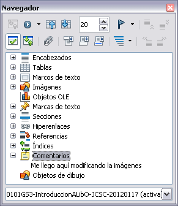

# 4. El Navegador

#### Usar el Navegador

El Navegador muestra todos los objetos contenidos en un documento agrupados por categorías. Por ejemplo, en Writer muestra los Encabezados, Tablas, Marcas de texto, Notas, Gráficos, Marcadores y otros elementos (vea Figura 13).

    Figura 13: El Navegador

En Calc muestra las Hojas, Nombres de rangos, Bases de datos, Gráficos, Objetos de dibujo, entre otros. En Impress y Draw muestra Diapositivas, Imágenes y otros elementos. Haga clic en el signo + o flecha de cualquier categoría para mostrar la lista de objetos en la misma. Para abrir el Navegador, haga clic en el icono  o  de la barra de herramientas Estándar, presione F5, o seleccione **Ver → Navegador** en la barra de menú principal.

**Puede acoplar el Navegador** a cualquier lateral de la ventana principal de LibreOffice o dejarlo flotando (vea “Barra de herramientas y ventanas acopladas/flotantes“).

Para ocultar la lista de categorías y mostrar sólo la barra de herramientas en la parte superior, haga clic en el icono Cuadro de lista activo/inactivo. Haga clic en este icono nuevamente para mostrar el cuadro de lista.

El Navegador facilita la movilidad y la búsqueda de elementos dentro del documento:

- Cuando una categoría muestra la lista los objetos que contiene, haga doble-clic en un objeto para ir directamente a la ubicación de dicho objeto en el documento. Es mucho más fácil hallar objetos si les da un nombre cuando los crea, en lugar de mantener los nombres por defecto de LibreOffice gráfico 1, gráfico 2, Tabla1, Tabla2, etcétera, lo cual no corresponde a la posición del objeto en el documento.

Si sólo desea ver el contenido en cierta categoría, resalte la categoría y haga clic en el icono de Visor de contenido
. Hasta que no vuelva a hacer clic, se mostrarán sólo los objetos de dicha categoría.
- Haga clic en el icono
(segundo icono de izquierda a derecha en la parte superior del Navegador) para mostrar la Barra de navegación (Figura 14). Aquí podrá elegir una categoría y utilizar los iconos Anterior y Siguiente para moverse de un elemento al siguiente. Esto es especialmente útil para hallar elementos como marcadores e índices que pueden ser difíciles de hallar.
- Los nombres de los iconos (mostrados en los mensajes emergentes) cambian para coincidir con la categoría seleccionada; por ejemplo, Gráfico siguiente o Marcador siguiente.

    Figura 14: barra de Navegación
- Para ir a una página concreta del documento, escriba el número de página en la caja ubicada en la parte superior del Navegador.

Al experimentar un poco con los demás iconos, se le mostrarán las distintas funcionalidades. Algunos usos específicos del componente serán descritos en los capítulos de Writer y de los otros componentes.

