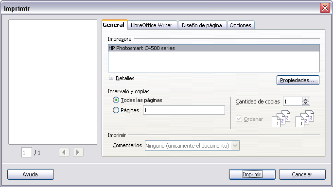

# 5. Imprimir

#### Introducción

Este capítulo provee información general acerca de como imprimir, exportar y enviar documentos por correo electrónico desde LibreOffice. 

#### **Impresión rápida**

Haga clic en el icono de Imprimir archivo directamente
para enviar el documento entero a la impresora predeterminada definida para su computadora.

**Nota**: Puede cambiar la acción del icono de **imprimir archivo directamente** para enviar el documento a la impresora definida para el documento en vez de a la impresora definida para la computadora. Vaya a **Herramientas → Opciones → Cargar/Guardar → General** y seleccione la opción **Cargar configuraciones de la impresora con el documento**.

#### Controlar la impresión

Para más control sobre la impresión, utilice **Archivo → Imprimir** para mostrar el cuadro de diálogo *Imprimir*.

En el cuadro de diálogo *Imprimir* podrá elegir:

- **Qué impresora usar** (si hay más de una instalada en su sistema) y las **propiedades** de la impresora—por ejemplo, orientación (vertical u horizontal), qué bandeja de papel usar, y en que tamaño de papel imprimir. Las propiedades disponibles dependen de la impresora seleccionada; consulte la documentación de la impresora para más detalles.

- **Qué páginas imprimir, cuántas copias y en qué orden imprimirlas**. Use guiones para especificar los intervalos de impresión y comas o punto y coma para separar intervalos; por ejemplo: 1, 5, 11–14, 34–40. *Selección* es la parte resaltada de una página o páginas.

- Qué elementos imprimir. Haga clic en la pestaña **Opciones** para mostrar el cuadro de diálogo de Opciones de impresión.

    Figura 1. El cuadro de diálogo Imprimir.
 

