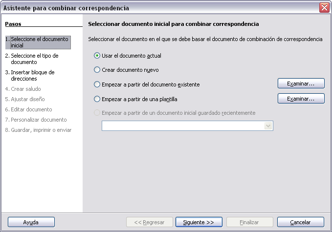
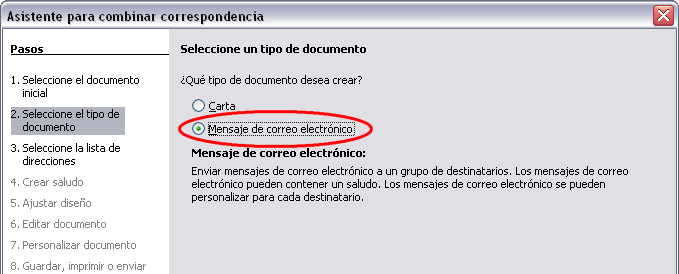
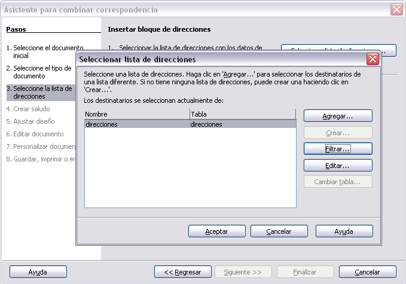
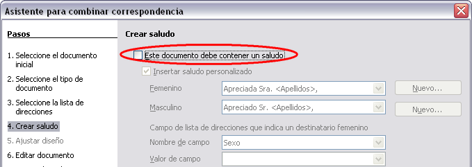
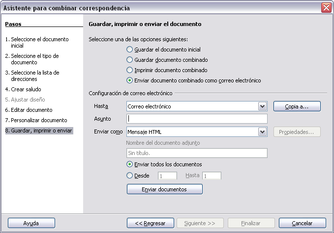

# 7. Enviar documentos por correo electrónico

#### Enviar un documento por correo electrónico a varios destinatarios

Para enviar un documento por correo electrónico a varios destinatarios, puede usar las funciones en su programa de correo electrónico o puede usar las facilidades de Combinar correspondencia de LibreOffice para extraer direcciones de correo electrónico de una libreta de direcciones.

Puede usar Combinar correspondencia de LibreOffice para enviar un correo electrónico de dos maneras:

- Use el Asistente para combinar correspondencia para crear el documento y enviarlo. Vea el capítulo 11 (Usar combinar correspondencia) de la guía de **Writer** para más detalles.

- Crear el documento en Writer sin usar el asistente, luego usar el asistente para enviarlo. Este método se describe a continuación.

Para usar el Asistente para combinar correspondencia para enviar un documento de Writer previamente creado:

1. Haga clic en **Herramientas → Asistente para combinar correspondencia**. En la primera página del asistente (8), seleccione **Usar el documento actual** y haga clic en **Siguiente**.

1. En la segunda página (9), seleccione **Mensaje de correo electrónico** y haga clic en **Siguiente**.

1. En la tercera página (10), haga clic en el botón **Seleccionar lista de direcciones**. Seleccione la lista de direcciones requerida (incluso si se muestra sólo una) y luego haga clic en **Aceptar**. (Si la lista de direcciones que necesita no se muestra aquí, puede hacer clic en **Añadir** para encontrarla y agregarla a la lista.)

1. De vuelta en la página Seleccionar lista de direcciones, haga clic en **Siguiente**. En la página Crear saludo (11), quite la selección de la opción **Este documento debe contener un saludo**.

1. De vuelta en la página Seleccionar lista de direcciones, haga clic en **Siguiente**. En la página Crear saludo (11), quite la selección de la opción **Este documento debe contener un saludo**.

1. En la lista de la mano izquierda, haga clic en **8. Guardar, imprimir o enviar**. LibreOffice muestra un mensaje que dice “Creando documentos” y luego vuelve a mostrar la página **Guardar**, imprimir o enviar del asistente.

1. Seleccione **Enviar documento combinado como correo electrónico**. La parte inferior de la página cambiará para mostrar las opciones de configuración de correo electrónico.

 

