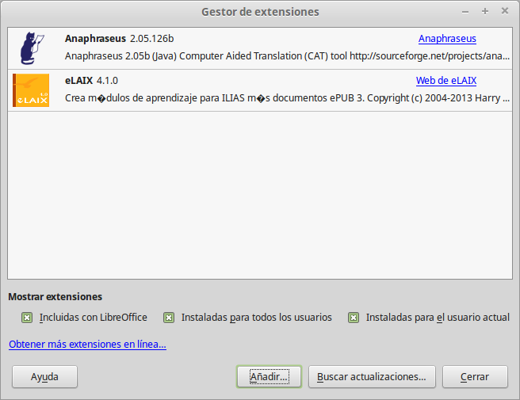
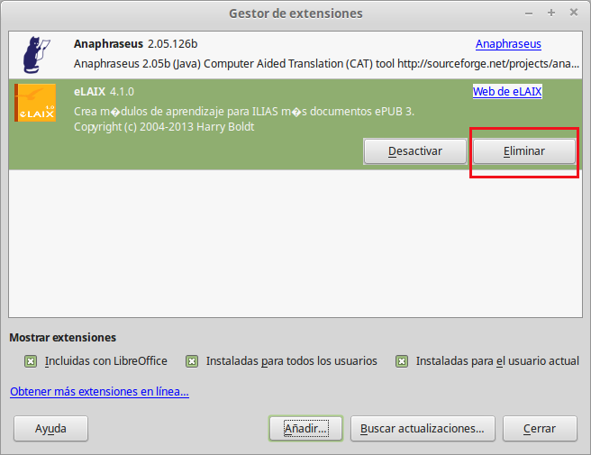

# 9. Añadiendo extensiones

## Administrador de extensiones

El Administrador de extensiones agrega, quita, habilita, inhabilita y actualiza extensiones de LibreOffice.

Seleccione **Herramientas - Gestor de extensiones**

A continuación se incluyen ejemplos de extensiones de LibreOffice:

1. Componentes UNO (módulos de software compilados)
1. Datos de configuración (para comandos de menú)
1. Bibliotecas de LibreOffice Basic
1. Bibliotecas de diálogos de LibreOffice
1. Archivos de extensiones (archivos *.oxt que contengan una o más extensiones)

## Para instalar una extensión

Una extensión está disponible como archivo con la extensión *.oxt.

Encontrará una colección de extensiones en la Red. Pulse en el enlace «Obtener más extensiones en línea» del Gestor de extensiones para abrir el navegador web y visitar el sitio [extensions.libreoffice.org](http://extensions.libreoffice.org/). Busque la extensión deseada y descárguela.

Seleccione **Herramientas - Gestor de extensiones.** Presione clic en Añadir para agregar una extensión.

Se abre un cuadro de diálogo de archivo en el que puede seleccionar las extensiones que desee agregar. Para copiar y registrar las extensiones seleccionadas, haga clic en Abrir.

Una extensión puede mostrar un diálogo de licencia. Lea la licencia. Presione el botón de desplazamiento para descender lo necesario. Haga clic en Aceptar para continuar la instalación de la extensión.

## Quitar

Seleccione la extension que desee eliminar y haga clic en Eliminar.

## Activar

Seleccione la extensión que quiera activar y pulse en Activar.

## Desactivar

Seleccione la extensión que desee desactivar y haga clic en desactivar.

## Buscar actualizaciones

Haga clic para comprobar las actualizaciones en línea de todas las extensiones instaladas. Para comprobar sólo las actualizaciones de las extensiones seleccionadas, elija el comando Actualizar del menú contextual. La verificación de actualizaciones se inicia de inmediato. Usted verá el diálogo [Actualización de extensiones](https://help.libreoffice.org/Common/Extension_Update/es).

## 

