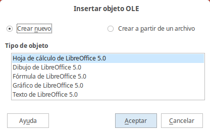
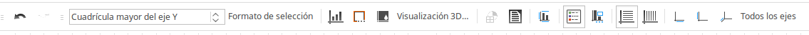
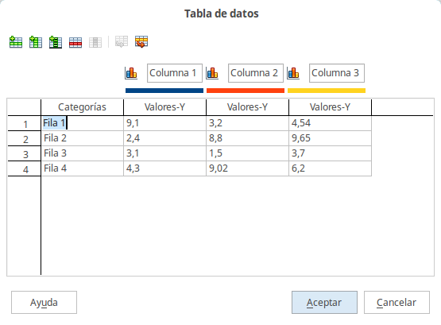

# Añadir gráficos, hojas de cálculo, diagramas y otros objetos

Los gráficos en Impress se manejan como en Draw.

Las hojas de cálculo incrustadas en Impress incluyen la mayoría de funciones de las hojas de Calc, y por eso son capaces de realizar cálculos extremadamente complejos y análisis de datos. Si necesita analizar sus datos o aplicar fórmulas, es mejor hacer estas operaciones en Calc y luego incrustar el resultado en Impress.

Para añadir una hoja de cálculo a una diapositiva, puede seleccionar **Insertar → Objeto ****→ Obejto OLE **en la barra de menú principal. Esto abre un menú que permite elegir entre varias opciones. Cuando se inserta una hoja de cálculo de esta forma, ya está en modo de edición.

Puede crearla de cero o elegir un archivo para insertarlo en la diapositiva.
<td width="707" bgcolor="#94bd5e">**Nota**</td><td width="3638">Si la inserta desde un archivo también puede enlazarlo o no. Si no lo enlaza, los cambios posteriores que realice en en el documento de hoja de cálculo no se actualizarán  en la diapositiva. Si lo enlaza sí que irán actualizándose.</td>

Si la inserta desde un archivo también puede enlazarlo o no. Si no lo enlaza, los cambios posteriores que realice en en el documento de hoja de cálculo no se actualizarán  en la diapositiva. Si lo enlaza sí que irán actualizándose.

Para añadir un **diagrama** a la diapositiva, seleccione el diseño correspondiente en la lista de diseños predefinidos del panel de tareas, o use la característica de **Insertar diagrama**.

Pasando el ratón por los distintos botones de la nueva ventana que aparece veremos la función de cada uno. Para editar los datos que generan el diagrama podemos clicar en **Tabla de datos... **y editarlos a nuestro gusto. Para **salir del modo de edición del diagrama** basta con clicar en cualquier zona libre de la ventana de LibreOffice.

Impress ofrece la posibilidad de insertar en una diapositiva otros tipos de objetos, tales como música o clips de vídeo, documentos de Writer, fórmulas de Math, objetos OLE, etc. Una presentación típica puede incluir objetos de este tipo, así como otros objetos no tan comunes.

