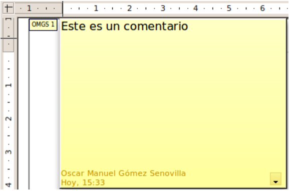

# Agregar comentarios a un dibujo

A partir de la versión 3.2 de LibreOffice, Draw soporta comentarios (antiguamente llamados “notas”) similares a los de Writer o Calc.

Elija **Insertar &gt; Comentario** en la barra de menú. Aparecerá un pequeño cuadro con sus iniciales en la esquina superior izquierda de la página de Draw, junto a un recuadro de texto más grande. Draw añade automáticamente su nombre y la fecha en la parte inferior del marco.

Escriba o pegue su comentario dentro del marco de texto. También puede seleccionar una parte del texto y aplicarle algún formato básico. Pulse el botón derecho del ratón y en el menú emergente y elija el formato deseado. Observe que desde éste menú también puede borrar el comentario actual o todos los comentarios de un mismo autor, al igual que todos los comentarios del documento.

También puede mover la marca del comentario a cualquier parte que desee de la página. Normalmente se colocan los comentarios encima o cerca del objeto al cual se hace referencia en el comentario.

Para mostrar u ocultar las marcas de los comentarios, elija **Ver &gt; Comentarios**.

Seleccione **Herramientas &gt; Opciones &gt; LibreOffice &gt; Datos del usuario** para configurar el nombre que desee que aparezca en el campo Autor del comentario, o para cambiar el actual.

Si hay más de una persona editando el documento, a cada autor se le asigna automáticamente un color de fondo distinto.

