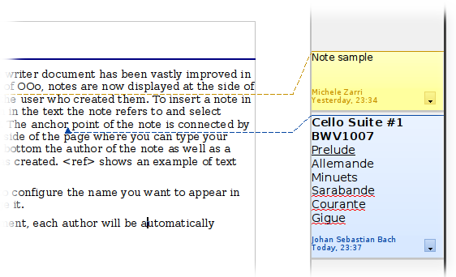

# Agregar comentarios a un documento

Con frecuencia los autores y los revisores usan comentarios (anteriormente se denominaban “notas”) para intercambiar ideas, solicitar sugerencias o marcar aquellos elementos que requieren atención.

Para insertar una nota en el texto, coloque el cursor en el lugar al que se refiere el comentario y seleccione **Insertar ****→**** Comentario** o presione *Ctrl+Alt+C*. El punto de anclaje del comentario es conectado a través de una línea de puntos a una caja situada a la derecha de la página donde podrá escribir el texto del comentario. Writer agregará automáticamente el nombre o las iniciales del autor al final, así como la fecha y la hora de su creación.

Seleccione **Herramientas ****→**** Opciones ****→**** LibreOffice ****→** Datos de usuario para configurar el nombre que desea que aparezca en el campo del Autor del comentario o para cambiarlo.

Si edita el documento más de una persona, a cada autor se le asignará un código diferente de fondo de color, para facilitar la identificación del autor de las distintas notas.

Al hacer clic en la flecha que aparece en la esquina inferior derecha de un comentario, se desplegará un menú que le permitirá borrar el comentario actual, eliminar todos los realizados por el mismo autor, o borrar todos los comentarios del documento. Desde este menú, puede aplicar igualmente algunos formatos básicos al texto del comentario. Desde el menú principal puede cambiar la tipografía, el tamaño y el alineamiento.

Si desea navegar desde un comentario a otro, abra el Navegador (pulsando *F5*), expanda la sección de Comentarios y haga clic en el texto para mover el cursor al punto de anclaje del comentario en el documento. Haga clic con el botón secundario sobre él para realizar una edición rápida o para eliminarlo.

Asimismo puede navegar por los comentarios mediante el teclado. Use *Ctrl+Alt+Av Pág* para dirigirse al siguiente comentario y *Ctrl+Alt+Re Pág* para regresar al comentario anterior.

