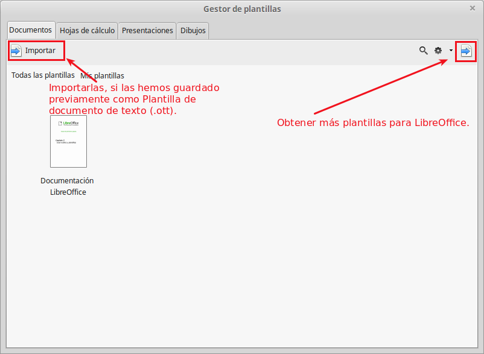
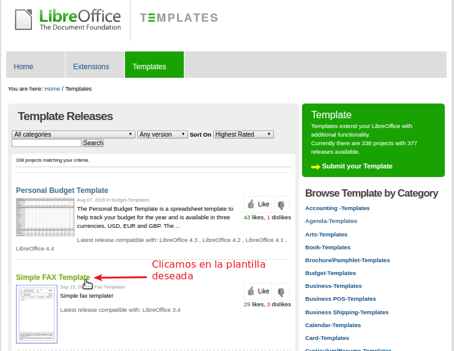

# Agregar plantillas

Para agregar plantillas abrimos el Gestor de plantillas que ya conocemos y podemos:

1. Importarlas, si las hemos guardado previamente como **Plantilla de documento de texto (.ott).**
1. Obtener más plantillas para LibreOffice.

Si elegimos la opción de obtener más plantilla para LibreOffice, se abrirá la web oficial de Extensiones y Plantillas de LibreOffice. Allí podremos buscar nuestra plantilla y descargarla para trabajar con ella.

