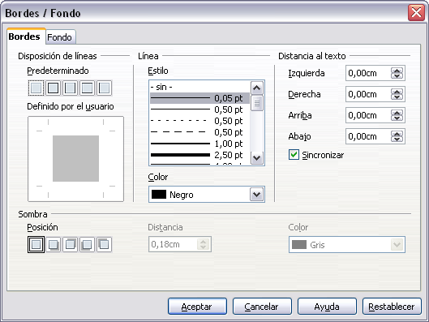

# Aspecto del encabezado o pie

Para cambiar la apariencia del encabezado o el pie, pulse **Más **en el diálogo de Encabezamiento o Pie de página que acabamos de ver.

En este diálogo puede establecer el fondo y borde del encabezado o pie de página.

