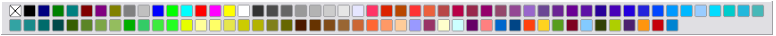
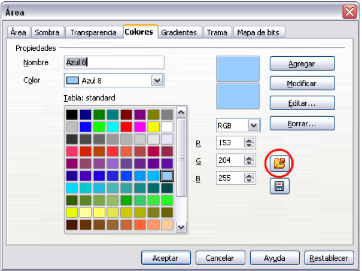
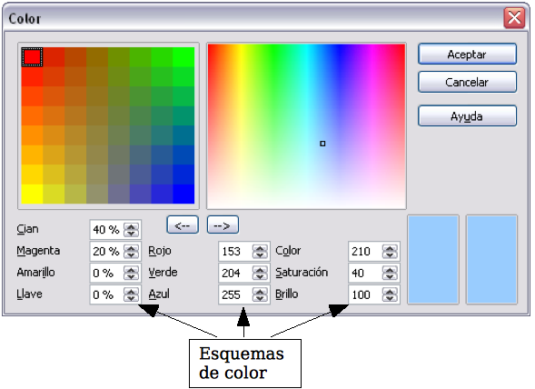

# Barra de colores

Para visualizar la barra de colores, use **Ver &gt; Barra de herramientas &gt; Barra de colores**. La barra de colores aparecerá en la parte inferior del área de trabajo.

Esta barra permite escoger rápidamente el color para los objetos del dibujo. El primer cuadro del panel corresponde a la transparencia (sin color).

Se puede acceder a varias paletas especializadas de colores en Draw, así como cambiar colores individualmente según su gusto. Esto se hace utilizando el diálogo Área, que se puede obtener eligiendo **Formato &gt; Relleno** o el icono *Relleno* en la Barra de herramientas Líneas y relleno.

En el diálogo área, elija la pestaña **Colores**.

Para cargar otra paleta, pulse el botón **Cargar listas de colores** (dentro del circulo rojo). El diálogo para seleccionar archivos le pide que elija una de las paletas estándar de LibreOffice.org (archivos con la extensión *.soc). Por ejemplo, web.soc es una paleta de color adaptada para crear dibujos que van a aparecer en páginas Web. Los colores se muestran correctamente en estaciones de trabajo con pantallas que pueden visualizar al menos 256 colores.

El cuadro de selección de colores también le permite cambiar cualquier color individualmente modificando los valores numéricos en los campos que están a la derecha de la paleta de colores. Puede usar los esquemas de colores conocidos como CMYK (cian, magenta, amarillo y negro), y RGB (rojo, verde y azul).

Al pulsar el botón **Editar** se abre un diálogo especial que permite la configuración de colores individuales. Se pueden introducir muchos valores en este diálogo.

En el área inferior se pueden introducir valores en formato RGB o CMYK, además del formato HSB (color, saturación y brillo).

En la parte inferior derecha, el rectángulo de la izquierda muestra el valor del color seleccionado, y el de la derecha, el valor nuevo.

Para una información más detallada de las paletas de colores y de sus opciones, vea el capítulo 8 (Consejos y trucos) en la *Guía de Draw*.

