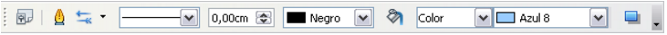
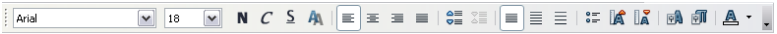

# Barra de herramientas de líneas y relleno

La barra de herramientas de líneas y relleno le permite modificar las propiedades principales de un objeto de dibujo.

Si se selecciona un texto, la barra cambiar de aspecto, como se muestra a continuación, similar a la barra de formato de Writer.

