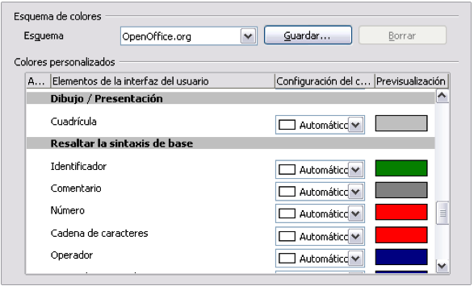

# Cambiar el color de los puntos de la cuadrícula

Por defecto, los puntos de la cuadrícula son de color gris claro, lo que dificulta su visión. Para mejorar su visibilidad utilice **Herramientas &gt; Opciones &gt;** **LibreOffice &gt; Apariencia**.

En la sección *Dibujo / Presentación*, se puede cambiar el color de los puntos de la cuadrícula. En el desplegable *Configuración de Color*, seleccione el que crea más adecuado o fácil de ver, como el negro.

