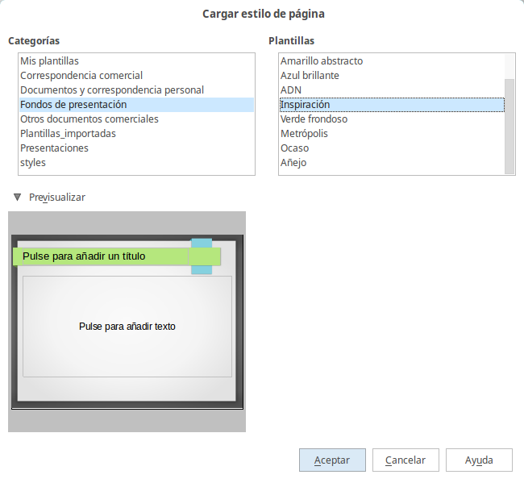

# Cargar diapositivas maestras adicionales

A veces, en el mismo grupo de diapositivas, se necesita mezclar varias diapositivas maestras de plantillas distintas. Por ejemplo, puede necesitar un estilo completamente diferente para la primera diapositiva, o puede querer introducir una diapositiva de otra presentación.

El diálogo de diseño de diapositivas hace esto posible. Acceda a él desde la barra de menú (**Formato → Diseño de diapositiva**) o pulsando el botón derecho en una diapositiva del panel de diapositivas.

La ventana principal del diálogo muestra las diapositivas maestras disponibles para usar. Para añadir más:

<li value="1">
Pulse el botón **cargar**.
</li>
<li>
Seleccione en el nuevo diálogo la plantilla desde la que desee importar la diapositiva maestra. Puede previsualizarla si quiere. Pulse **Aceptar****.**
</li>
<li>
Pulse otra vez **Aceptar** para cerrar el diálogo.
</li>

Seleccione en el nuevo diálogo la plantilla desde la que desee importar la diapositiva maestra. Puede previsualizarla si quiere. Pulse **Aceptar****.**

Las diapositivas maestras de la plantilla seleccionada se mostrarán en la sección páginas maestras del panel de tareas, en la subsección *Disponible*.
<td width="699" bgcolor="#94bd5e">**Nota**</td><td width="3646">Las diapositivas maestras que ha cargado estarán disponibles la próxima vez que se cargue la presentación. Si quiere borrar las diapositivas maestras que no utilice, pulse la casilla de selección correspondiente en el diálogo de Diseño de Diapositivas. Debido a un error, si la diapositiva maestra no está siendo utilizada en la presentación, quedará finalmente borrada de la lista de diapositivas mostradas.</td>

Las diapositivas maestras que ha cargado estarán disponibles la próxima vez que se cargue la presentación. Si quiere borrar las diapositivas maestras que no utilice, pulse la casilla de selección correspondiente en el diálogo de Diseño de Diapositivas. Debido a un error, si la diapositiva maestra no está siendo utilizada en la presentación, quedará finalmente borrada de la lista de diapositivas mostradas.
<td width="699" bgcolor="#83caff">**Sugerencia**</td><td width="3646">Para evitar que el tamaño de la presentación sea demasiado grande, puede reducir el número de diapositivas maestras utilizadas.</td>

Para evitar que el tamaño de la presentación sea demasiado grande, puede reducir el número de diapositivas maestras utilizadas.

