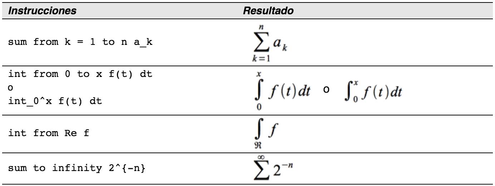

# ¿Cómo añado límites a mi suma o integral?

Las instrucciones “sum” e “int” pueden utilizar, opcionalmente, los parámetros “from” y “to”. Estos parámetros sirven para fijar límites inferiores y superiores, respectivamente, y se pueden utilizar juntos o por separado. Los límites para las integrales normalmente se tratan como subíndice y superíndice.

<td width="700" bgcolor="#94bd5e">**Nota**</td><td width="4415">Para más detalles sobre integrales y sumas, vea el capítulo Objetos de Math en la *Guía de **Writer.** *</td>

Para más detalles sobre integrales y sumas, vea el capítulo Objetos de Math en la *Guía de **Writer.*

