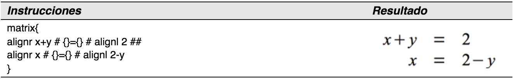
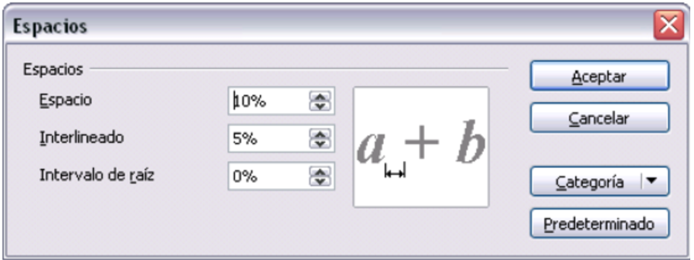

# ¿Cómo alineo mis ecuaciones con el signo de igual?

LibreOffice Math no tiene una instrucción para alinear ecuaciones a un carácter en particular, pero se puede utilizar una matriz para conseguirlo, como se muestra a continuación:

Las llaves vacías alrededor del signo = son necesarias porque se trata de un operador binario, y por lo tanto, se necesita una expresión en cada lado.

Se puede reducir la cantidad de espacio alrededor del signo = si se cambia el espacio entre columnas de la matriz:

<li value="1">
Abra el editor de ecuaciones y elija **Formato &gt; Espaciado** desde la barra de menú.
</li>

<li>
En el diálogo Espacios, pulse el botón **Categoría** y seleccione **Matrices** en el menú desplegable.
</li>
<li>
Introduzca **0%** en Distancia entre columna, y pulse **Aceptar**.
</li>

Introduzca **0%** en Distancia entre columna, y pulse **Aceptar**.

