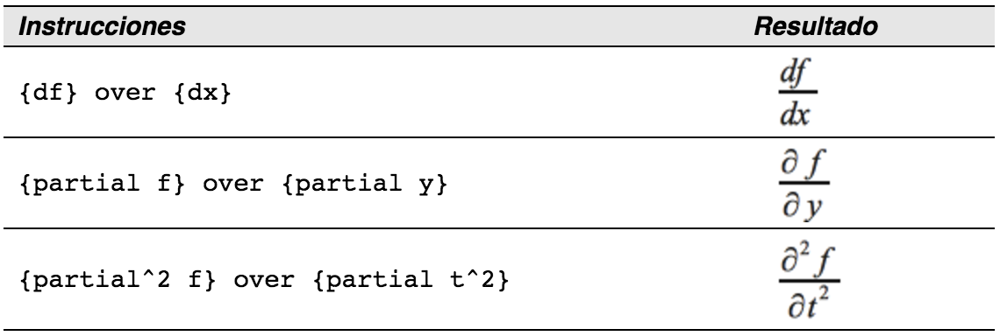

# ¿Cómo puedo hacer una derivada?

Para hacer derivadas, básicamente sólo hay que aplicar un truco sencillo: *indicar a LibreOffice** que se trata de una fracción.*

En otras palabras, hay que utilizar el comando “over”. Si se combina con la letra “d” (para una derivada total) o con el comando “partial” (para una derivada parcial), se consigue el efecto deseado.

<td width="700" bgcolor="#94bd5e">**Nota**</td><td width="4415">Hay que usar las llaves “{“ y “}” para crear la derivada.</td>

Hay que usar las llaves “{“ y “}” para crear la derivada.

