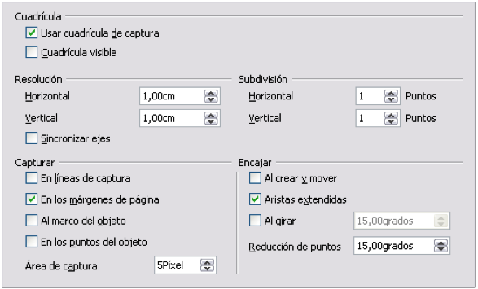

# Configurar la cuadrícula

El color, los espacios y la resolución de los puntos de la cuadricula se pueden elegir individualmente para cada eje. El espacio entre las líneas se define en el diálogo Opciones de la cuadrícula bajo el área de dibujo en las opciones de LibreOffice.org (**Herramientas**** &gt; Opciones &gt; LibreOffice Draw &gt; Cuadrícula**).

En el diálogo de la imagen, se pueden configurar los siguientes parámetros:

<li>
El espacio vertical y horizontal entre los puntos de la cuadrícula. También se pueden cambiar las unidades de medida usadas en las opciones generales de Draw (**Herramientas**** ****&gt; Opciones &gt; LibreOffice ****Draw**** &gt; General**).
</li>
<li>
La resolución es el tamaño de los cuadrados o rectángulos en la cuadrícula. Si la resolución horizontal es 1 cm y la vertical 2 cm, la cuadrícula tendrá rectángulos de 2 cm de alto y 1 cm de ancho.
</li>
<li>
Las subdivisiones son puntos adicionales que aparecen a lo largo de cada lado de cada rectángulo o cuadrado de la cuadrícula. Los objetos se ajustan tanto a las subdivisiones como a las esquinas de la cuadrícula.
</li>
<li>
El tamaño en píxeles (puntos) del área de ajuste define cuánto hay que acercar un objeto a un punto o a una línea antes de que tenga lugar la acción de ajustar.
</li>

La resolución es el tamaño de los cuadrados o rectángulos en la cuadrícula. Si la resolución horizontal es 1 cm y la vertical 2 cm, la cuadrícula tendrá rectángulos de 2 cm de alto y 1 cm de ancho.

El tamaño en píxeles (puntos) del área de ajuste define cuánto hay que acercar un objeto a un punto o a una línea antes de que tenga lugar la acción de ajustar.

