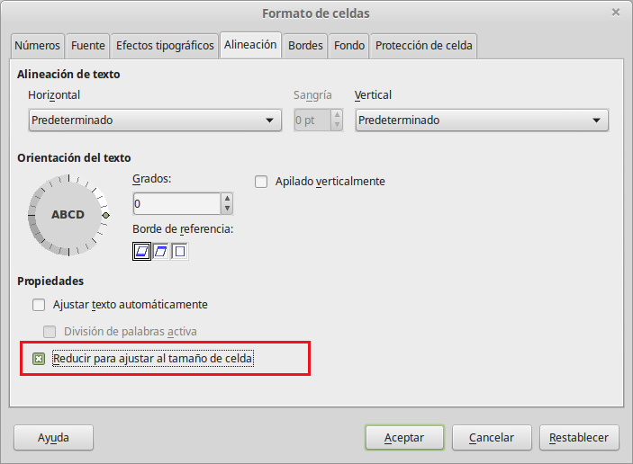

# Contraer texto para ajustarse a la celda

El tamaño de la letra de los datos puede ajustarse automáticamente para que se adapte al de la celda. Para hacer esto, seleccione la opción **Reducir para ajustar al tamaño de la celda** en el diálogo Formato celdas. El resultado sería el siguiente.

