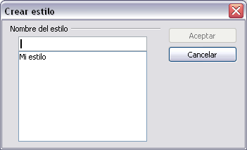

# Crear estilos nuevos

Es posible que desee añadir nuevos estilos. Esto puede hacerse de dos maneras:

<li value="1">
Creando un estilo nuevo utilizando el diálogo de estilos.
</li>
<li>
Creando un estilo nuevo a partir de una selección.
</li>

Creando un estilo nuevo a partir de una selección.

## Crear un estilo nuevo utilizando el diálogo de estilos

Para crear un estilo nuevo utilizando el Diálogo de estilos, pulse con el botón derecho en la ventana de Estilo y formato y seleccione **Nuevo** en el menú emergente.

Si desea que su nuevo estilo esté vinculado con un estilo ya existente, primero debe seleccionar ese estilo, y luego, pulsando con el botón derecho, seleccione **Nuevo**.

Si tiene estilos vinculados y más tarde modifica el estilo en que se basa el nuevo (por ejemplo, al cambiar las fuentes de Times a Helvetica), todos los estilos vinculados también cambiarán. Algunas veces esto es exactamente lo que se desea, pero otras veces puede que no desee que los cambios se apliquen a todos los estilos vinculados. Esta característica debe planearse con cuidado antes de utilizarla.

Los diálogos y las posibilidades de elección son las mismas tanto para definir estilos nuevos como para modificar los existentes. Vea los capítulos sobre estilos en las guías de usuario para más detalles.

## Crear un nuevo estilo a partir de una selección

<li value="1">
Abra la ventana de Estilo y formato y elija el tipo de estilo que desee crear.
</li>
<li>
En el documento, seleccione el elemento que desee guardar como un estilo.
</li>
<li>
En la ventana de Estilo y formato, pulse con el ratón sobre el icono de **Nuevo estilo a partir de selección**.
</li>
<li>
En el diálogo de Crear estilo, escriba el nombre del estilo nuevo. La lista muestra los nombres de los estilos personalizados existentes relacionados con el tipo de elemento seleccionado. Pulse **Aceptar** para guardar el nuevo estilo.
</li>

En el documento, seleccione el elemento que desee guardar como un estilo.

En el diálogo de Crear estilo, escriba el nombre del estilo nuevo. La lista muestra los nombres de los estilos personalizados existentes relacionados con el tipo de elemento seleccionado. Pulse **Aceptar** para guardar el nuevo estilo.

## Arrastrar y soltar para crear un nuevo estilo

Para crear un nuevo estilo, se puede arrastrar y soltar una selección de texto dentro de la ventana de Estilo y formato.

**En Writer**

Seleccione un texto y arrástrelo dentro de la ventana de Estilo y formato. Si los estilos de párrafo están activos, se añadirá un estilo de párrafo a la lista de estilos. Si son los estilos de carácter los activos, se añadirá a la lista de estilos de carácter.

**En Calc**

Arrastre una selección de una celda a la ventana de Estilo y formato para crear estilos de celda.

**En Draw e Impress**

Seleccione y arrastre objetos de dibujo a la ventana de Estilo y formato para crear nuevos estilos de gráficos.

