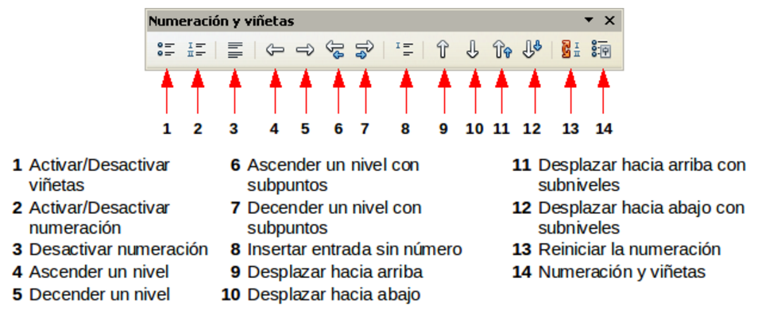

# Crear listas numeradas o con viñetas

Hay diferentes maneras de crear listas numeradas o con viñetas:

<li value="1">
Usar el formato automático, como se explicó anteriormente.
</li>
<li>
Usar estilos de listas (numeradas), como se describe en el módulo 3.
</li>
<li>
Usar los iconos de Numeración y de Viñetas que aparecen en la barra de herramientas de Formato de párrafo: seleccione los párrafos de la lista y a continuación haga clic en el icono apropiado de la barra de herramientas.
</li>

Usar estilos de listas (numeradas), como se describe en el módulo 3.
<td width="16%" bgcolor="#94bd5e">**Nota**</td><td width="84%">Es una cuestión de gusto personal escribir primero la información y luego aplicar los formatos para numeración o para viñetas, o aplicar los formatos a medida que se escribe la información.</td>

Es una cuestión de gusto personal escribir primero la información y luego aplicar los formatos para numeración o para viñetas, o aplicar los formatos a medida que se escribe la información.

## Usar las barras de herramientas de Numeración y viñetas

Puede crear listas jerárquicas con viñetas (en las que uno o más elementos de la lista tiene a su vez una lista inferior, como en el caso de los esquemas) usando los botones que aparecen en la barra de herramientas de Numeración y viñetas. Puede mover los puntos de la lista a niveles superiores o inferiores, o también crear niveles inferiores de puntos e incluso cambiar el estilo de las viñetas. Use **Ver ****→**** Barras de herramientas ****→**** Numeración y viñetas** para ver la barra de herramientas. También se activará cuando se encuentre editando una lista.

