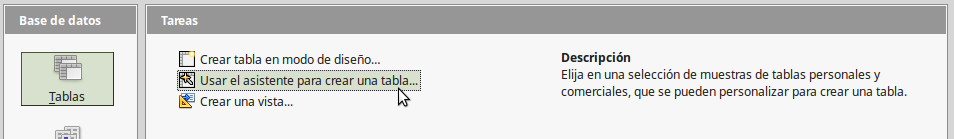

# Crear tablas

En una base de datos, una tabla almacena información de un grupo de cosas que llamaremos campos. Por ejemplo, una tabla podría contener una libreta de direcciones, un inventario de existencias, una guía telefónica o una lista de precios. Una base de datos puede tener varias tablas.

Para trabajar con tablas, pulse el icono *Tablas* en la lista de *Base de datos*. En la lista *Tareas* se muestran las tres tareas que se pueden hacer con tablas.

