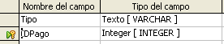

# Crear tablas para los cuadros de lista

Si se puede usar la misma información en varios campos, intente diseñar una tabla para cada tipo de información. Cada tabla contendrá dos campos: el campo de información y el *ID*, en ese orden.
<td width="16%" bgcolor="#ffd320">**Precaución **</td><td width="84%" valign="top">**Debe** crear estas tablas con el campo de información en **primer lugar** y el campo ID en **último lugar**. Si no lo hace así se producirán resultados incorrectos. Para la tabla de pagos he usado Nombre e ID como campos, con *Dan*, *Kevin* y *Efectivo* en los datos de Nombre. Los datos correspondientes a ID son *0, 1, 2*. Si el campo Nombre se muestra primero en la tabla, aparecerá uno de los tres nombres en el campo pago de la tabla Combustible. Si el campo ID se muestra primero, en el campo de pago aparecerán *1, 2* o *3.*</td>

<li>
Siga las instrucciones vistas en “Crear tablas en la vista de diseño”. En la tabla, los dos campos pueden ser *Tipo* e *IDPago*. En las propiedades del campo establezca *Valor automático *a **Sí** en el campo *IDPago*. Establezca el campo *IDPago* como *Llave principal.* 
</li>
<li>
Guarde la tabla con el nombre *Tipo pago*.
</li>

Guarde la tabla con el nombre *Tipo pago*.

<td width="15%" bgcolor="#94bd5e">**Nota**</td><td width="85%" valign="top">Si tiene que crear varias tablas con los mismos campos, diseñe una tabla y cree las demás mediante [copiar y pegar](https://raw.githubusercontent.com/catedu/libreOffice-la-suite-ofimatica-libre/master/crear_una_tabla_copiando_una_tabla_existente.html).</td>

Si tiene que crear varias tablas con los mismos campos, diseñe una tabla y cree las demás mediante [copiar y pegar](crear_una_tabla_copiando_una_tabla_existente.html).

