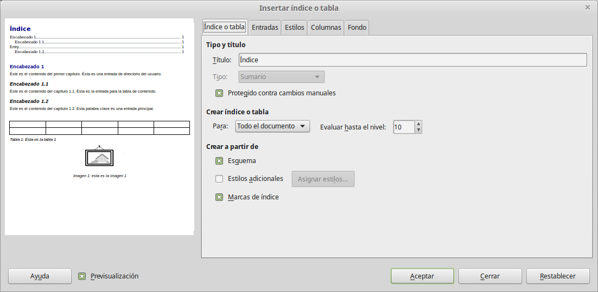

# Crear un índice temático

Writer dispone de una funcionalidad que le permite construir un índice temático de manera automática a partir de los encabezados del documento. Antes de empezar, asegúrese de que los encabezados tengan un estilo coherente. Por ejemplo, puede usar el estilo de *Encabezado 1* para los títulos de capítulos y el estilo de *Encabezado 2 y Encabezado 3 *para los subtítulos.

Aunque Writer permite una alta personalización de esta funcionalidad, en la mayoría de los casos la configuración predeterminada será suficiente. Crear un índice temático es sencillo:

<li>
Cuando cree su documento, use los siguientes estilos de párrafo, para establecer los diferentes niveles de encabezados (como títulos de capítulos o de secciones): *Encabezado 1*, *Encabezado 2*, y *Encabezado 3*, y así sucesivamente.
</li>
<li>
Coloque el cursor donde desee insertar el índice.
</li>
<li>
Seleccione **Insertar ****→**** Índices y tablas****→**** Índices...** 
</li>
<li>
No realice ningún cambio en en el diálogo de Insertar índice/tabla y haga clic en **Aceptar**.
</li>

Coloque el cursor donde desee insertar el índice.

No realice ningún cambio en en el diálogo de Insertar índice/tabla y haga clic en **Aceptar**.

Si agrega o borra un texto (de modo que los encabezados se desplacen a otras páginas diferentes) o si agrega, borra o cambia encabezados, tendrá que actualizar el índice temático. Para ello, haga lo siguiente:

<li>
Coloque el cursor dentro de la tabla de contenidos.
</li>
<li>
Haga clic con el botón secundario y seleccione **Actualizar índice/ ****tabla **en el menú emergente.
</li>

Haga clic con el botón secundario y seleccione **Actualizar índice/ ****tabla **en el menú emergente.

En cualquier momento puede personalizar un índice temático ya existente. Haga clic con el botón secundario en cualquier parte de éste y seleccione **Editar índice/tabla** en el menú emergente.

