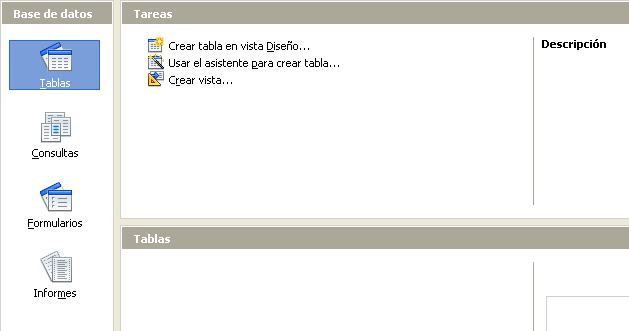

# Crear una base de datos nueva

Para crear una base de datos nueva, en la barra de menús elija **Archivo → Nuevo → Base de datos**, también puede pulsar la flecha que hay junto al icono **Nuevo** y seleccionar** Base de datos** en el menú desplegable. Ambos métodos abren el asistente para bases de datos.

En la primera página del asistente para bases de datos seleccione **Crear nueva base de datos** y pulse **Siguiente**.

La segunda página tiene dos preguntas. Para la primera pregunta seleccione la opción **Sí, registrar la base de datos**, y para la segunda pregunta marque **Abrir la base de datos para editar**. Pulse **Finalizar**.
<td width="13%" bgcolor="#94bd5e">**Nota**</td><td width="87%" valign="top">Si no se registra la base de datos, no estará accesible para los otros componentes de LibreOffice, como Writer o Calc. Si se registra la base de datos, los otros componentes podrán acceder a ella.</td>

Si no se registra la base de datos, no estará accesible para los otros componentes de LibreOffice, como Writer o Calc. Si se registra la base de datos, los otros componentes podrán acceder a ella.

Guarde la base de datos nueva con el nombre *Automovil*. Se abrirá la ventana Automovil.odb – LibreOffice Base.

<td width="15%" bgcolor="#83caff">**Sugerencia**</td><td width="85%" valign="top">Cada vez que se abra la base de datos *Automovil*, se abre la ventana Automovil.odb – LibreOffice Base, y entonces se pueden hacer cambios en la base de datos. El título de esta ventana es siempre &lt;nombre de la base de datos→ - LibreOffice Base.</td>

Cada vez que se abra la base de datos *Automovil*, se abre la ventana Automovil.odb – LibreOffice Base, y entonces se pueden hacer cambios en la base de datos. El título de esta ventana es siempre &lt;nombre de la base de datos→ - LibreOffice Base.
<td width="15%" bgcolor="#ffd320">**Precaución **</td><td width="85%" valign="top">Cuando cree una base de datos, debe guardar el trabajo regularmente. No sólo tiene que guardar el elemento que acaba de crear, sino que también tiene que guardar la base de datos completa.Por ejemplo, cuando cree su primera tabla, debe guardarla antes de poder cerrarla. Cuando la tabla se guarde por primera vez, ya será parte de la base de datos.</td>

Por ejemplo, cuando cree su primera tabla, debe guardarla antes de poder cerrarla. Cuando la tabla se guarde por primera vez, ya será parte de la base de datos.

