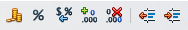
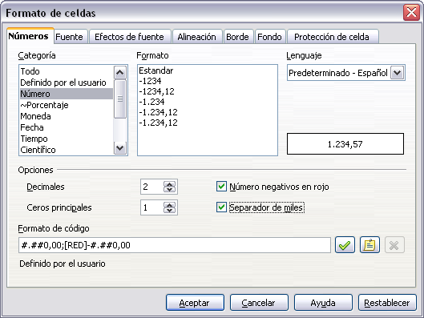

# Dar formato a los números

Se pueden aplicar varios formatos numéricos a una celda usando los iconos en la Barra de formato. Seleccione la celda, y pulse el icono adecuado.

Para mayor control o seleccionar otros formatos numéricos, use la pestaña Números del diálogo Formato de celdas.

<li>
Aplique a los datos cualquiera de los tipos de datos de la lista Categoría.
</li>
<li>
Controle el número de lugares decimales y ceros a la izquierda.
</li>
<li>
Introduzca un código de formato personalizado.
</li>

Controle el número de lugares decimales y ceros a la izquierda.

Las preferencias de Idioma controla las preferencias locales para los distintos formatos, como el orden de las fechas y el símbolo monetario.

