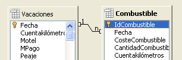
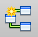
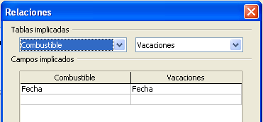
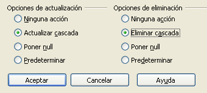

# Definir relaciones

Ahora que hemos creado las tablas, ¿cuál son las relaciones entre ellas? Es el momento de definirlas, basándonos en las preguntas y respuesta del principio.

Cuando estamos de vacaciones, queremos introducir todos los gastos de una sola vez cada día. La mayoría de estos gastos están en la tabla Vacaciones, pero el combustible que gastamos no lo está. Por eso relacionaremos estas dos tablas usando el campo Fecha. Puesto que la tabla Combustible puede tener más de una entrada por fecha, esta relación entre las tablas Vacaciones y Combustible es una relación uno a muchos (se designa 1:n).

La tabla Vacaciones también contiene varios campos para el tipo de pago usado. Por cada campo de tipo de pago hay sólo una entrada de la tabla Tipo Pago. Esta es una relación uno a uno: un campo en una tabla con un campo de la otra tabla (se designa 1:1). Hay otras tablas que también contienen campos del tipo de pago. La relación entre los campos de esas tablas y Tipo Pago es también una relación 1:1.

Puesto que la tabla Tipo Pago solamente proporciona un lista estática, no necesitamos definir una relación entre la tabla Tipo Pago y los campos de las otras tablas que usan las entradas de la tabla Tipo Pago. Esto se hará cuando creemos los formularios.

Las tablas Combustible y Mantenimiento realmente no tienen ninguna relación aunque tengan campos similares: Fecha y Cuentakilómetros.
<td width="661" bgcolor="#83caff">**Sugerencia**</td><td width="3684">A medida que cree sus propias bases de datos, también tendrá que determinar en qué y cómo están relacionadas las tablas.</td>

A medida que cree sus propias bases de datos, también tendrá que determinar en qué y cómo están relacionadas las tablas.

<li value="1">
Para empezar a definir relaciones elija **Herramientas → Relaciones**.
</li>
<li>
En el diálogo Añadir tablas, use uno de los siguientes métodos para añadir una tabla a la ventana Diseño de relaciones:
</li>

En el diálogo Añadir tablas, use uno de los siguientes métodos para añadir una tabla a la ventana Diseño de relaciones:

<li value="1">
Haga doble clic sobre el nombre de la tabla. En nuestro caso, hágalo en las tablas *Vacaciones* y *Combustible*. 
</li>
<li>
O pulse en el nombre de la tabla y luego **Añadir** para cada una de las tablas.
</li>

O pulse en el nombre de la tabla y luego **Añadir** para cada una de las tablas.

<li>
Haga clic en **Cerrar** para cerrar el diálogo cuando haya añadido las tablas que desee.
</li>
<li>
Puede definir la relación entre las tablas Vacaciones y Combustible de dos modos:
</li>

Puede definir la relación entre las tablas Vacaciones y Combustible de dos modos:

<li>
Seleccione y arrastre el campo *Fecha* en la tabla *Combustible* hasta el campo *Fecha* en la tabla *Vacaciones*. Cuando suelte el botón del ratón, se formará una línea de conexión entre los dos campos.
</li>

<li>
</li>

<ul>
<li value="1">
En la sección *Campos implicados*, pulse la lista desplegable que se encuentra bajo la etiqueta *Combustible.*
</li>
<li>
Seleccione *Fecha* en la lista de la tabla *Combustible*.
</li>

Seleccione *Fecha* en la lista de la tabla *Combustible*.

Haga clic sobre la celda que se encuentra a la derecha de esta lista desplegable. Esto abrirá una lista desplegable para la tabla Vacaciones.

Seleccione *Fecha* en la lista de la tabla Vacaciones. Ahora todo debería parecerse a lo mostrado en la Figura 10.

Pulse **Aceptar**.

<li>
Modificar las *Opciones de actualización* y *Opciones de eliminación* de la ventana Relaciones.
</li>

<li>
Haga clic con el botón secundario sobre la línea que conecta los campos Fecha de las dos tablas para abrir el menú contextual.
</li>
<li>
Seleccione **Editar** para abrir el diálogo Relaciones.
</li>
<li>
Seleccione **Actualizar cascada**.
</li>
<li>
Seleccione **Eliminar cascada**.
</li>
<li>
Pulse **Aceptar** para cerrar la ventana Relaciones y seleccione **Archivo → Guardar** para guardar la ventana Diseño de relaciones.
</li>

Seleccione **Editar** para abrir el diálogo Relaciones.

Seleccione **Eliminar cascada**.

Aunque estas opciones no son estrictamente necesarias, sirven de ayuda. Tenerlas seleccionadas permite actualizar una tabla que tenga una relación definida con otra tabla, así como eliminar un campo de una tabla.

