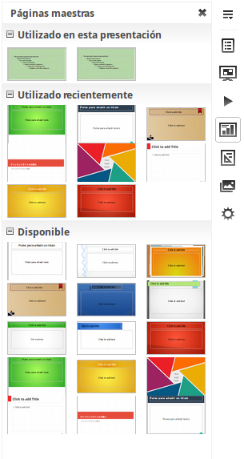

# Diapositivas maestras

<td width="699" bgcolor="#94bd5e">**Nota**</td><td width="3646">LibreOffice utiliza dos términos intercambiables para este concepto: *diapositiva maestra *o* página maestra*. En este curso sólo utilizaremos el término *diapositiva maestra*, excepto cuando se esté describiendo la interfaz de usuario.</td>

LibreOffice utiliza dos términos intercambiables para este concepto: *diapositiva maestra *o* página maestra*. En este curso sólo utilizaremos el término *diapositiva maestra*, excepto cuando se esté describiendo la interfaz de usuario.

Una diapositiva maestra tiene definido un conjunto de características, que incluyen el color de fondo, gráfico o degradado; objetos de fondo como logos o líneas decorativas, encabezados y pies de página, posición y tamaño de marcos de texto, además del formato del texto.

Todas estas características se controlan con *estilos.* Los estilos de cualquier nueva diapositiva que se cree se heredan de su diapositiva maestra en el momento de crearse. En otras palabras, los estilos de la diapositiva maestra se aplican a todas las diapositivas creadas a partir de ella. Cambiar un estilo de una diapositiva maestra implica cambiar los de todas las diapositivas basadas en ella. Sin embargo, es posible modificar individualmente cada diapositiva sin afectar a la maestra.

Las diapositivas maestras tienen dos tipos de estilos asociados a ellas: *estilos de presentación *y *estilos de gráficos.* Los estilos predefinidos de presentación se puede modificar, pero no se pueden crear nuevos. Sín embargo, para los estilos de gráficos, se puede tanto modificar los existentes como crear estilos nuevos. Qué estilos usar y cuando usarlos se explica más adelante.

**Los**** estilos de presentación **afectan a tres elementos de una diapositiva maestra: el fondo, los objetos de fondo (iconos, líneas decorativas y cuadros de texto) y el texto situado en la diapositiva. Los estilos de texto a su vez están divididos en *notas, esquema 1 *hasta *esquema 9, subtítulo *y *título*. Los estilos de esquema se utilizan para los diferentes niveles del esquema al que pertenecen. Por ejemplo, Esquema 2 se usa para los puntos inferiores del Esquema 1, y el Esquema 3 se usa para los puntos inferiores del Esquema 2.

**Los ****estilos gráficos **afectan a varios elementos de la diapositiva. Nótese que estos estilos existen tanto en los estilos de gráficos como en los de presentación.

