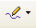
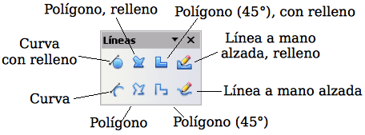

# Dibujar curvas

<td width="101" bgcolor="#94bd5e">**Nota**</td><td width="627" valign="top">Al mover el ratón por encima de este icono, se ve la etiqueta *Curva.* Si convierte el icono en una barra flotante, el título cambiará a *Líneas*, como se ve en siguiente imagen.</td>

Al mover el ratón por encima de este icono, se ve la etiqueta *Curva.* Si convierte el icono en una barra flotante, el título cambiará a *Líneas*, como se ve en siguiente imagen.

Si se mueve el ratón sobre un icono, aparecerá una etiqueta emergente con una descripción de la función.

**Polígonos**

Dibuje la primera línea desde su punto de partida, manteniendo pulsado el botón izquierdo del ratón. Justo cuando suelte el botón del ratón, se dibujará un primer punto, y entonces se podrá ver el aspecto de la segunda línea al mover el ratón. Cada vez que se pulse el ratón, se creará otro vértice. Para finalizar la figura, haga doble clic con el ratón. Un polígono con relleno une automáticamente el punto final con el primero, para cerrar la figura, y se rellena con el color estándar de relleno actual. Un polígono sin relleno no se cerrará al terminar de dibujarse.

**Polígono de 45°**

Al igual que con los polígonos corrientes, éstos estarán formados por líneas, pero con ángulos de 45 o 90 grados entre ellas.

**Líneas a mano alzada**

Con esta herramienta se puede dibujar como si fuese con un lápiz. Mantenga pulsado el botón izquierdo del ratón y muévalo. No es necesario terminar la acción de dibujar haciendo doble clic, sino que basta con soltar el botón del ratón. Si ha seleccionado *Línea a mano alzada, relleno*, el punto final se unirá automáticamente con el punto inicial, y el objeto se rellenará con el color apropiado.

