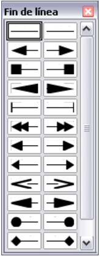

# Dibujar flechas

Hay varios tipos de puntas de flecha. Cada uno de los extremos de las líneas puede tener una punta de flecha distinta (o ninguna).

Las puntas de flecha se aplican sólo a las líneas. No tienen ningún efecto sobre los bordes de un objeto.

Se pueden modificar los estilos de las líneas y las flechas y crear unos propios.

