# Dibujar formas geométricas

Las formas geométricas incluyen las formas básicas, los símbolos y flechas, gráficos de flujo, llamadas y estrellas.

La siguiente imagen muestra parte de la barra de herramientas de Draw con los iconos que se explican en las siguientes secciones. Al pulsar el ratón en la pequeña flecha al lado de un icono se abre una barra flotante de herramientas con las herramientas relevantes de trabajo. El uso de todas ellas es similar a las ya explicadas para herramientas de Rectángulo, aún cuando ellas generan otras formas geométricas diferentes.

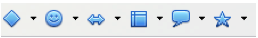
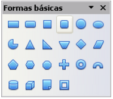
El icono **Formas Básicas** da acceso a las herramientas para dibujar formas básicas.

Si elige la herramienta rectángulo de esta barra de herramientas, tendrá el mismo aspecto que el de la barra de herramientas de Draw. La única diferencia que puede observar se encuentra en la información que se muestra en el campo de información de la barra de estado (por ejemplo: forma seleccionada).

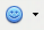
El icono **Formas de símbolos** proporciona una serie de herramientas para dibujar varias formas de símbolos.

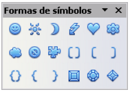

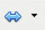
El icono de **Flechas de bloque **abre la barra de herramientas de flechas.

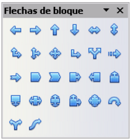
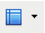
Las herramientas para dibujar gráficos de flujo se consiguen pulsando el icono **Diagrama de flujo** .

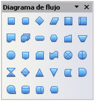

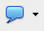
Use el icono **Llamadas **para abrir la barra de herramientas de llamadas.

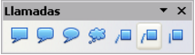
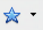
Estas herramientas están asociadas con el icono Estrellas. Se pueden añadir textos a todas esas formas.

### Modos de selección

Existen tres modos de selección: mover y cambiar el tamaño, rotar y editar puntos.

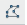
En el modo estándar (cuando se empieza un dibujo nuevo), el botón Puntos no está activado y su modo por defecto funciona para mover o para alterar el tamaño de la selección. La selección viene indicada por cuadros pequeños de color verde o azul.

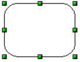
Cuando el botón Puntos está activo, el modo por defecto es para editar la selección. Estas selecciones están indicadas por cuadros azules. Algunos objetos pueden tener uno o más puntos de control extra, con un color distinto y también más grandes. Esto se explica con más detalle en la Guía de Draw.

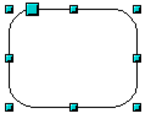
Las selecciones para rotar objetos están indicadas por pequeños círculos de color rojo y un símbolo que representa el centro de rotación. Para elegir esas selecciones, clique dos veces sobre el objeto.

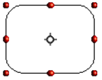
