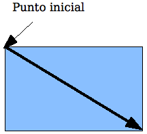

# Dibujar un rectángulo o un cuadrado

Mantenga pulsada la tecla *Mayúsculas* para dibujar un cuadrado. Mantenga pulsada la tecla *Alt* para dibujar el rectángulo a partir de su punto central. Para combinar los efectos, mantenga pulsadas las teclas *Mayúsculas* y *Alt* simultáneamente. (Para que esto funcione primero debe hacer clic en la página dejando presionado, luego pulsar y mantener las teclas deseadas y, ahora sí, arrastrar).

