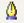

# Editar objetos

Para cambiar los atributos de un objeto (como el color, ancho de los bordes, etc) puede usar la barra Líneas y relleno o el menú contextual.

Cuando se selecciona un texto, esta barra de herramientas se transforma mostrando las opciones para formato de texto.

Cuando se selecciona un objeto, se puede pulsar con el botón derecho del ratón el objeto para mostrar un **menú contextual**, que proporciona acceso rápido a las opciones mostradas anteriormente y a otras formas de cambiar los atributos de un objeto. Las entradas con un triangulo pequeño a la derecha contienen un submenú.

