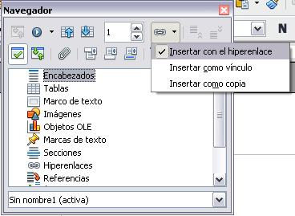
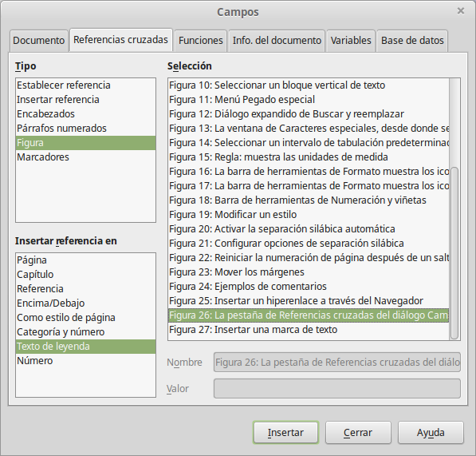

# Enlazar a otras partes del documento

Al establecer referencias a otras partes del documento puede ocurrir que éstas queden desactualizadas si se reorganiza el orden de los temas, se añade o elimina material o se retoca un encabezado. Writer ofrece dos formas de asegurarse de que las referencias están actualizadas a través de la inserción de vínculos o enlaces a otras partes del mismo documento o de un documento diferente:

<li>
Hiperenlaces
</li>
<li>
Referencias cruzadas
</li>

Referencias cruzadas

Con ambos métodos se obtiene el mismo resultado si hace *Control*+*clic *sobre el vínculo al abrir el documento en Writer: se dirige directamente al elemento con el que se ha establecido la referencia cruzada. Sin embargo, también presentan notables diferencias:

<li>
El texto de un hiperenlace **no** se actualiza automáticamente si se cambia el texto del elemento enlazado (aunque se puede cambiar de forma manual), mientras que es el texto modificado el que se actualiza automáticamente en la referencia cruzada.
</li>
<li>
Al usar un hiperenlace, no se puede elegir el contenido del enlace (por ejemplo, texto o número de página), mientras que, al usar una referencia cruzada, se dispone de varias opciones, incluidas las marcas de texto.
</li>
<li>
Para establecer un hiperenlace con un objeto como un gráfico y conseguir que el hiperenlace muestre un texto útil tiene que, o bien ponerle un nombre útil a ese objeto en lugar de dejarlo con el nombre predeterminado (“Gráfico6”), o bien usar el diálogo Hiperenlace para modificar el texto visible. Por el contrario, las referencias cruzadas a las ilustraciones con textos muestran de forma automática el texto útil y permiten distintas variaciones del nombre.
</li>
<li>
Si guarda un documento Writer en HTML, los hiperenlaces permanecerán activos, pero las referencias cruzadas no. (Ambos siguen activos si el documento se exporta a PDF).
</li>

Al usar un hiperenlace, no se puede elegir el contenido del enlace (por ejemplo, texto o número de página), mientras que, al usar una referencia cruzada, se dispone de varias opciones, incluidas las marcas de texto.

Si guarda un documento Writer en HTML, los hiperenlaces permanecerán activos, pero las referencias cruzadas no. (Ambos siguen activos si el documento se exporta a PDF).

## Usar hiperenlaces

La forma más sencilla de insertar un hiperenlace en otra parte del mismo documento es mediante el Navegador:

<li>
Abra el documento que contiene los elementos entre los que desea establecer la referencia.
</li>
<li>
Abra el Navegador (haciendo clic en el icono, eligiendo **Ver ****→**** Navegador** o presionando *F5*).
</li>
<li>
</li>
<li>
En la lista de la parte inferior del Navegador, seleccione el documento que contiene el elemento con el que desea establecer la referencia.
</li>
<li>
En la lista del Navegador, seleccione el elemento que desea insertar como hiperenlace.
</li>
<li>
Arrastre el elemento a la ubicación del documento donde desea insertar el hiperenlace. El nombre del elemento se inserta como un hiperenlace activo en el documento.
</li>

Abra el Navegador (haciendo clic en el icono, eligiendo **Ver ****→**** Navegador** o presionando *F5*).

En la lista de la parte inferior del Navegador, seleccione el documento que contiene el elemento con el que desea establecer la referencia.

Arrastre el elemento a la ubicación del documento donde desea insertar el hiperenlace. El nombre del elemento se inserta como un hiperenlace activo en el documento.

De igual modo, puede usar el diálogo de Hiperenlace si desea insertar y modificar los hiperenlaces dentro de un documento o entre distintos documentos. 

## Usar referencias cruzadas

Si incluye de forma manual referencias a otras partes del documento, éstas pueden quedar fácilmente desactualizadas si modifica alguna palabra de un encabezado, añade o elimina ilustraciones o reorganiza los temas. Reemplace las referencias cruzadas que haya incluido manualmente por referencias automáticas, de forma que, cuando actualice los campos, todas ellas se actualicen automáticamente y muestren la redacción o los números de página actuales. La pestaña de *Referencias cruzadas* del diálogo Campos muestra algunos elementos, tales como encabezados, marcas de texto, ilustraciones, tablas y elementos numerados, como por ejemplo los pasos en un procedimiento.

Para insertar un referencia cruzada a un encabezamiento o a un texto:

<li>
En el documento, coloque el cursor en el lugar donde desea que aparezca la referencia cruzada.
</li>
<li>
Si el diálogo de Campos no está abierto, haga clic en **Insertar ****→**** Referencia cruzada**. En la pestaña *Referencias cruzadas*, en la lista *Tipo de campo*, seleccione el tipo de elemento al cual se va a hacer referencia (por ejemplo, *Encabezado* o *Figura*).
</li>

Si el diálogo de Campos no está abierto, haga clic en **Insertar ****→**** Referencia cruzada**. En la pestaña *Referencias cruzadas*, en la lista *Tipo de campo*, seleccione el tipo de elemento al cual se va a hacer referencia (por ejemplo, *Encabezado* o *Figura*).

<li>
Puede mantener esta página abierta si inserta muchas referencias cruzadas.
</li>
<li>
Haga clic en los elementos que desee de la lista *Selección*, que muestra todos los elementos del tipo seleccionado. En la lista *Insertar referencia en*, elija el formato deseado. Normalmente será **Texto de leyenda** (para insertar el texto completo de un encabezado o de un pie de ilustración), **Categoría y número**** **(para insertar la palabra “Ilustración” o “Tabla” y su número correspondiente, pero sin pie), **Numeración** (para insertar solamente el número de la tabla o de la ilustración, sin incluir la palabra “Ilustración” o “Tabla”), o **Página**** **(Para insertar el número de la página en la que aparece el texto de referencia). Haga clic en **Insertar**.
</li>

Haga clic en los elementos que desee de la lista *Selección*, que muestra todos los elementos del tipo seleccionado. En la lista *Insertar referencia en*, elija el formato deseado. Normalmente será **Texto de leyenda** (para insertar el texto completo de un encabezado o de un pie de ilustración), **Categoría y número**** **(para insertar la palabra “Ilustración” o “Tabla” y su número correspondiente, pero sin pie), **Numeración** (para insertar solamente el número de la tabla o de la ilustración, sin incluir la palabra “Ilustración” o “Tabla”), o **Página**** **(Para insertar el número de la página en la que aparece el texto de referencia). Haga clic en **Insertar**.

 

 

