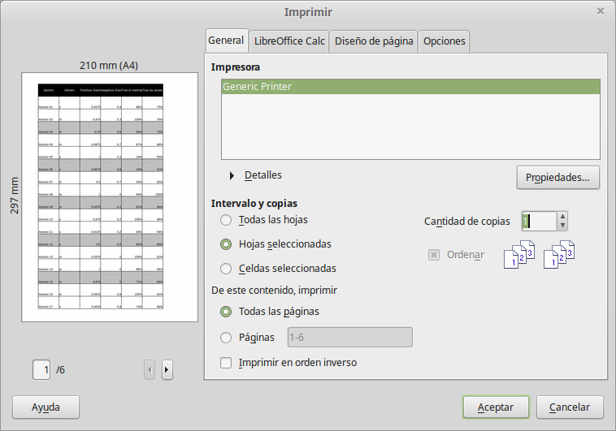

# Imprimir

Imprimir desde Calc es igual que imprimir desde otros componentes de LibreOffice (vea el módulo 2), pero algunos detalles son diferentes, especialmente lo concerniente a la preparación de la impresión.

El diálogo de impresión en el menú **Archivo ****→**** Imprimir**, tiene algunas opciones específicas de Calc: qué hojas imprimir.

