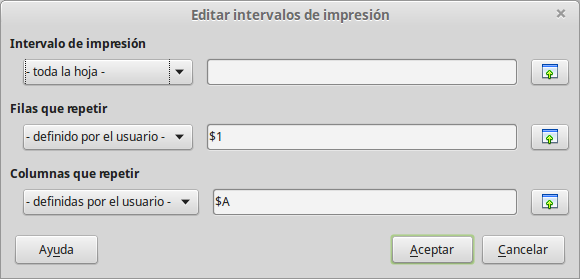

# Imprimir filas o columnas en cada página

Si se imprime una hoja en múltiples páginas, se puede establecer que ciertas filas o columnas se repitan en cada página.

Por ejemplo, si se necesitan imprimir las dos primeras filas de la hoja así como la columna A, haga lo siguiente:

<li value="1">
Elija **Formato **→** Intervalos de impresión **→** Editar**. En el diálogo Editar áreas de impresión, escriba las filas en el campo de texto debajo de *Fila que repetir*. Por ejemplo, para repetir las filas 1 a la 4, escriba **$1:$4**. En la lista *Fila que repetir ***-ninguno-** cambia a **-definida por usuario-**.
</li>

<li>
La columnas también se pueden repetir. Escriba las columnas en el campo de texto debajo de *Columna a repetir*. Por ejemplo, para repetir la columna A, escriba **$A**. En la lista Columna a repetir, el contenido cambia de **– ninguno –** a **– definido por el usuario -**.
</li>
<li>
Pulse **Aceptar.**
</li>

Pulse **Aceptar.**

