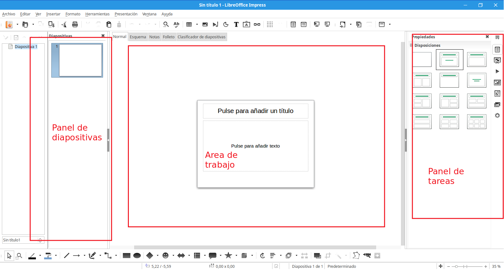

# ¿Qué es Impress?

## Referencia

Todo el contenido de este módulo ha sido obtenido de la[ documentación oficial de LibreOffice](https://wiki.documentfoundation.org/Documentation/es). Podéis consultarla con más detalle en [este documento](https://wiki.documentfoundation.org/images/b/b9/0100GS3-PrimerosPasosConLibO.pdf) así como acceder a la autoría de este material. Se ha comprobado el correcto funcionamiento de todo lo expuesto a continuación, utilizando la versión de LibreOffice 5.0.3.2 

## Conocimiento previo

Este capítulo incluye instrucciones, capturas de pantalla y consejos para orientarse en el entorno de Impress mientras se diseñan presentaciones sencillas.

El uso de Impress para presentaciones un poco más avanzadas requiere un conocimiento de los elementos que forman parte de las diapositivas. Aquéllas que contienen texto, utilizan estilos para definir la apariencia de dicho texto. Las diapositivas que contienen objetos se crean del mismo modo que los dibujos en Draw.

## Partes de la ventana principal de Impress

La pantalla principal de Impress tiene tres partes: el *panel de diapositivas*, el *área de trabajo*, y el *panel de tareas.* Además, hay multitud de barras de herramientas que se pueden mostrar u ocultar durante la creación de una presentación.

