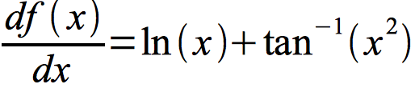
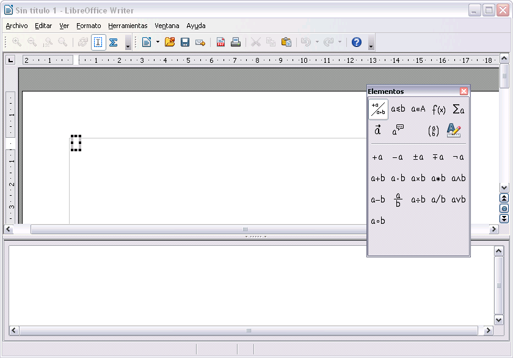

# LibreOffice Math

## Conocimiento previo

Todo el contenido de este módulo ha sido obtenido de la [documentación oficial de LibreOffice](https://wiki.documentfoundation.org/Documentation/es). Podéis consultarla con más detalle en [este documento](https://wiki.documentfoundation.org/images/5/56/0109GS3-PrimerosPasosConMath.pdf) así como acceder a la autoría de este material. Se ha comprobado el correcto funcionamiento de todo lo expuesto utilizando la versión de LibreOffice 5.0.3.2 

Contenido revisado por [CATEDU](http://www.catedu.es/webcatedu/).

Math es el componente de LibreOffice para escribir ecuaciones matemáticas. Su uso más común es el de un editor de ecuaciones para documentos de texto, pero también se puede utilizar con otros tipos de documentos o por sí solo. Cuando se utiliza dentro de Writer, a la ecuación se la trata como un objeto dentro del documento de texto.
<td width="700" bgcolor="#94bd5e">**Nota**</td><td width="4415">El editor de ecuaciones es para escribir ecuaciones de forma simbólica (como en la ecuación 1). Si lo que se desea es evaluar un valor numérico, vea la *Guía de Calc*.</td>

El editor de ecuaciones es para escribir ecuaciones de forma simbólica (como en la ecuación 1). Si lo que se desea es evaluar un valor numérico, vea la *Guía de Calc*.

Para insertar una ecuación en LibreOffice Writer, debe ir a **Insertar &gt; Objeto &gt; Fórmula**.

El editor de ecuaciones se abre en la parte inferior de la pantalla, y aparece la ventana flotante Elementos de fórmula (antes de Math 3.2, se llamaba “Selección”). También aparecerá una caja pequeña con un borde gris en su documento, donde se verá la fórmula como se muestra en la imagen.

