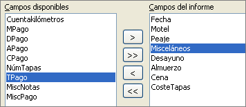
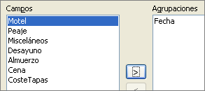

# Informe de la tabla Vacaciones

Para crear un informe nuevo:

<li value="1">
Pulse el** icono *****Informes*** en la lista Base de datos en la ventana Automóvil – LibreOffice.
</li>
<li>
En la lista Tareas pulse **Usar el asistente para crear informe**. Se abre el Asistente para informes.
</li>

En la lista Tareas pulse **Usar el asistente para crear informe**. Se abre el Asistente para informes.

### **Paso 1: selección de campos**

<li value="1">
Seleccione *Tabla:Vacaciones* en la lista desplegable Tabla o consulta.
</li>
<li>
Utilice **&gt;** para mover estos campos desde la lista *Campos disponibles* a la lista *Campos del informe*: Fecha, Motel, Peajes, Misceláneos, Desayuno, Almuerzo, Cena y CosteTapas. Haga clic en **Siguiente**.
</li>

Utilice **&gt;** para mover estos campos desde la lista *Campos disponibles* a la lista *Campos del informe*: Fecha, Motel, Peajes, Misceláneos, Desayuno, Almuerzo, Cena y CosteTapas. Haga clic en **Siguiente**.

### **Paso 2: poner etiquetas a los campos**

Cambie las etiquetas de los campos que desee. Acortaremos Misceláneos a Misc. Haga clic en **Siguiente**.

### **Paso 3: agrupar**

Puesto que estamos agrupando por fecha, utilice el botón **&gt;** para mover el campo *Fecha* a la lista Agrupaciones. Pulse **Siguiente**.

### **Paso 4: opciones para ordenar**

No queremos ordenar nada más. Haga clic en **Siguiente**.

### **Paso 5: selección del diseño**

Utilice las opciones predeterminadas para el diseño. Pulse **Siguiente**.

### **Paso 6: crear el informe**

<li>
Ponga el título del informe: Gastos vacaciones.
</li>
<li>
Seleccione Informe estático.
</li>
<li>
Haga clic en **Finalizar**.
</li>

Seleccione Informe estático.
<td width="15%" bgcolor="#94bd5e">**Nota**</td><td width="85%" valign="top">Si se siente con espíritu aventurero, pruebe a seleccionar algún otro diseño. Después de seleccionar una opción, arrastre la ventana asistente para formularios para quitarla de en medio y poder ver lo que ha seleccionado. Para mover la ventana, ponga el cursor sobre la barra de título y arrástrela.</td>

Si se siente con espíritu aventurero, pruebe a seleccionar algún otro diseño. Después de seleccionar una opción, arrastre la ventana asistente para formularios para quitarla de en medio y poder ver lo que ha seleccionado. Para mover la ventana, ponga el cursor sobre la barra de título y arrástrela.

