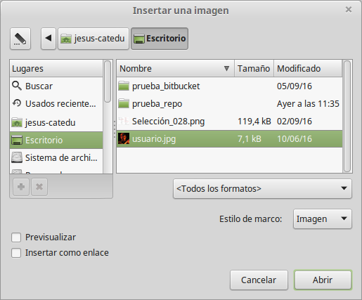

# Insertar un gráfico desde un archivo

<li>
Determine el destino de la imagen. Coloque el cursor en la localización apropiada (o cerca de ésta) en el documento.
</li>
<li>
En en menú principal, seleccione **Insertar → Imagen**.
</li>
<li>
Navegue hasta el archivo que desea insertar, selecciónelo y haga clic en **Abrir**.
</li>

En en menú principal, seleccione **Insertar → Imagen**.
<td width="699" bgcolor="#94bd5e">**Nota**</td><td width="3646">En la parte inferior del cuadro de diálogo Insertar imagen 1 hay dos casillas de verificación. Si la opción **Previsualización **está activa, se puede visualizar una imagen en miniatura del archivo gráfico seleccionado, como se muestra en la 1. Así puede comprobar que ha seleccionado el archivo correcto. La opción **Vincular** crea un enlace al archivo que contiene la imagen, en vez de guardar una copia del gráfico dentro del documento. El resultado es que la imagen se muestra en el documento, pero cuando éste se guarde, contendrá sólo una referencia al archivo gráfico, pero no la propia imagen.</td>

En la parte inferior del cuadro de diálogo Insertar imagen 1 hay dos casillas de verificación. Si la opción **Previsualización **está activa, se puede visualizar una imagen en miniatura del archivo gráfico seleccionado, como se muestra en la 1. Así puede comprobar que ha seleccionado el archivo correcto. La opción **Vincular** crea un enlace al archivo que contiene la imagen, en vez de guardar una copia del gráfico dentro del documento. El resultado es que la imagen se muestra en el documento, pero cuando éste se guarde, contendrá sólo una referencia al archivo gráfico, pero no la propia imagen.

