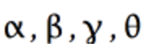
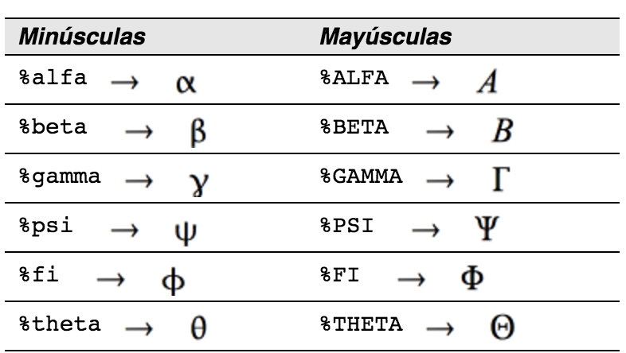
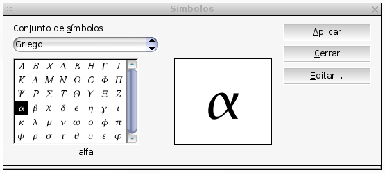
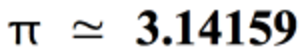
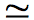
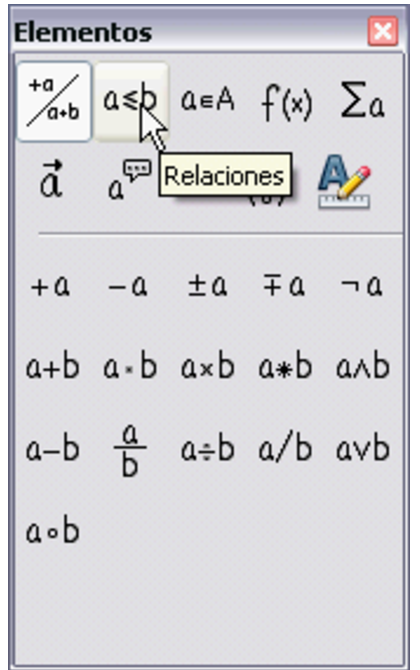
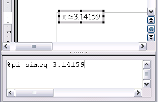

# Letras griegas

<li>
Para *introducir un carácter en minúsculas*, escriba el nombre de la letra en minúsculas.
</li>
<li>
Para *introducir un carácter en mayúsculas*, escriba el nombre de la letra en mayúsculas.
</li>

Para *introducir un carácter en mayúsculas*, escriba el nombre de la letra en mayúsculas.

Vea la tabla de abajo para algunos ejemplos.

<td width="700" bgcolor="#94bd5e">**Nota**</td><td width="4415">En el capítulo Objetos Matemáticos de la *Guía de **Writer*, se puede encontrar una tabla completa de caracteres griegos.</td>

En el capítulo Objetos Matemáticos de la *Guía de **Writer*, se puede encontrar una tabla completa de caracteres griegos.

Otra forma de introducir caracteres griegos es utilizando la ventana de catálogo de símbolos. Ir a **Herramientas &gt; Catálogo**. Se puede ver esta ventana en la Figura 7. Debajo de “Conjunto de símbolos” seleccione “Griego” y haga doble clic sobre una letra griega de la lista.

Para este ejemplo supondremos que:

<li>
Queremos introducir la fórmula de arriba (el valor de pi se redondea a 5 decimales).
</li>
<li>
Conocemos el nombre del carácter griego (“pi”).
</li>
<li>
</li>

Conocemos el nombre del carácter griego (“pi”).

**Paso 1**: Escriba “%” seguido por el texto “pi”. Esto mostrará el carácter griego .

**Paso 2**: Abra la ventana de Elementos de fórmula (**Ver &gt; Elementos de fórmula**).

La Figura 9 muestra la ventana Elementos de fórmula después de pulsar el botón Relaciones. El símbolo que queremos está dentro del círculo.

**Paso 5**: Borre el texto &lt;?&gt; y añada 3.14159 al final de la ecuación. Con esto, la instrucción final es %pi simeq 3.14159. El resultado se muestra en la siguiente imagen.

