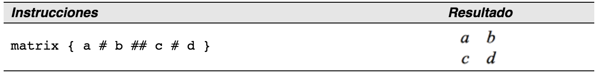
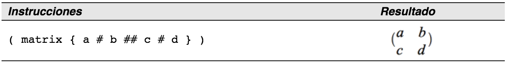
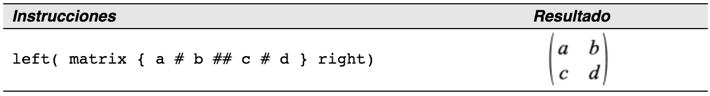

# ¡Los paréntesis no se ajustan a las matrices!

Como base, empezaremos con información general sobre el comando “matrix”.

<td width="700" bgcolor="#94bd5e">**Nota**</td><td width="4415">Para separar filas, se usa dos veces el símbolo de almohadilla (“##”), y para las entradas dentro de cada fila, una vez (“#”).</td>

Para separar filas, se usa dos veces el símbolo de almohadilla (“##”), y para las entradas dentro de cada fila, una vez (“#”).

El primer problema que uno se suele encontrar con las matrices es que los paréntesis no se ajustan al tamaño de éstas:

LibreOffice Math tiene paréntesis “ajustables”. Es decir, los paréntesis aumentan su tamaño para ajustarse al tamaño de su contenido. Utilice los comandos left y right (izquierda y derecha) para hacer que los paréntesis sean escalables en el lado indicado.

<td width="16%" valign="top" bgcolor="#83caff">**Sugerencia**</td><td width="84%">Utilice *left[* y *right] *para obtener corchetes (“[“ y “]”).</td>

