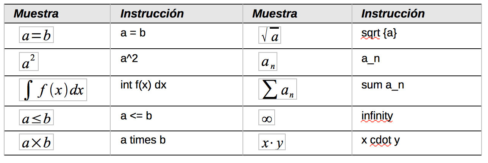

# Marcas

Se pueden escribir directamente las marcas sobre el editor de ecuaciones. Por ejemplo, se puede escribir “5 times 4” para obtener 5X4. Esta puede ser la forma más rápida de introducir una fórmula si se conoce la marca.
<td width="16%" bgcolor="#83caff">**Sugerencia**</td><td width="84%">El lenguaje de marcas de las fórmulas se parece a la forma en que la fórmula se lee en inglés.</td>

El lenguaje de marcas de las fórmulas se parece a la forma en que la fórmula se lee en inglés.

A continuación se muestra una lista breve de las ecuaciones comunes y sus instrucciones correspondientes en el lenguaje de marcas.

