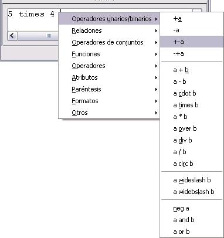

# Menú del botón derecho del ratón

Otra forma de acceder a los símbolos matemáticos es pulsando el botón derecho del ratón sobre el editor de ecuaciones. Esto muestra el menú emergente que se puede ver en la siguiente imagen.

