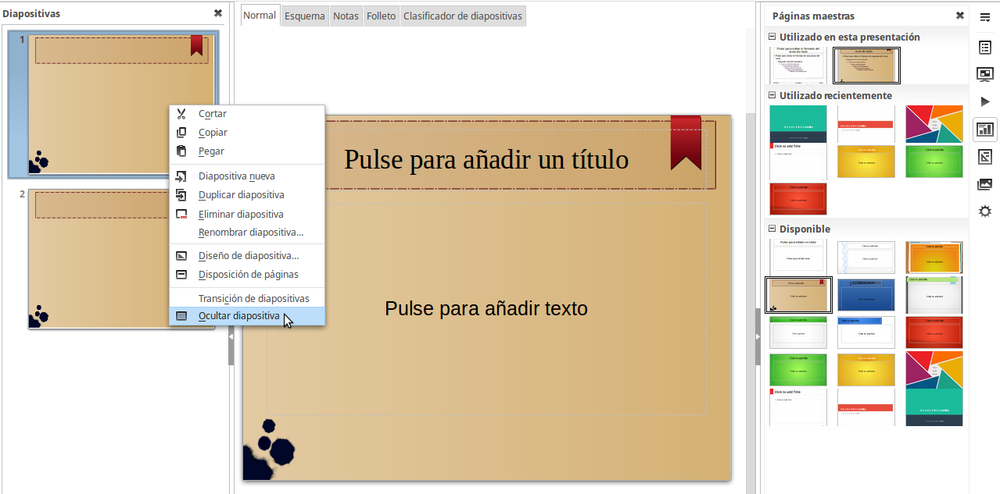

# Modificar el aspecto de las diapositivas

Para cambiar la imagen de fondo y otras características de todas las diapositivas de la presentación, es necesario modificar la diapositiva maestra o elegir una diapositiva maestra diferente.

Una diapositiva maestra es aquélla cuyas características se utilizan como punto de partida para crear otras diapositivas. Estas características incluyen el fondo, objetos en el fondo, formato de textos y gráficos de fondo.
<td width="699" bgcolor="#94bd5e">**Nota**</td><td width="3646">LibreOffice utiliza dos términos intercambiables para este concepto: *diapositiva maestra *o* página maestra*. En este curso sólo utilizaremos el término *diapositiva maestra*, excepto cuando se describa la interfaz de usuario.</td>

LibreOffice utiliza dos términos intercambiables para este concepto: *diapositiva maestra *o* página maestra*. En este curso sólo utilizaremos el término *diapositiva maestra*, excepto cuando se describa la interfaz de usuario.

Impress varias diapositivas maestras prediseñadas, que se encuentran en la sección *Páginas maestras *del panel de tareas. También se pueden crear y guardar diapositivas maestras adicionales.

##  Modificar la presentación final

Ahora revise la presentación entera y responda algunas preguntas. Ejecute la presentación al menos una vez antes de responderlas. Puede que quiera añadir alguna más.

<li value="1">
¿Están en el orden correcto?
</li>
<li>
Si añade alguna diapositiva extra ¿ayudará a aclarar algún punto?
</li>
<li>
¿Ayudarán a alguna diapositiva animaciones personalizadas? (Técnica avanzada)
</li>
<li>
¿Deben tener algunas diapositivas transiciones diferentes?
</li>
<li>
¿Hay diapositivas innecesarias? Si así fuera, elimínelas.
</li>

Si añade alguna diapositiva extra ¿ayudará a aclarar algún punto?

¿Deben tener algunas diapositivas transiciones diferentes?
<td width="707" bgcolor="#83caff">**Sugerencia**</td><td width="3638">Si alguna de estas diapositivas parece innecesaria, ocúltela y vuelve a ver la presentación un par de veces para asegurarse. Para esto, pulse con el botón derecho sobre la diapositiva en el panel de diapositivas y seleccione **Ocultar diapositiva **en el menú emergente. No elimine una diapositiva hasta haber hecho esto, ya que si no tendrá que crear de nuevo la diapositiva.</td>

Si alguna de estas diapositivas parece innecesaria, ocúltela y vuelve a ver la presentación un par de veces para asegurarse. Para esto, pulse con el botón derecho sobre la diapositiva en el panel de diapositivas y seleccione **Ocultar diapositiva **en el menú emergente. No elimine una diapositiva hasta haber hecho esto, ya que si no tendrá que crear de nuevo la diapositiva.

Una vez haya respondido a estas preguntas, haga los cambios pertinentes. Esto es más sencillo de hacer en la vista de organizador de diapositivas.

