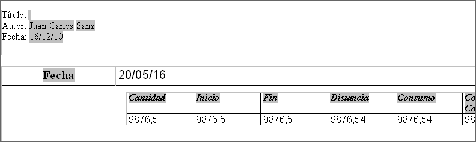
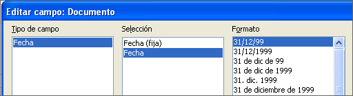
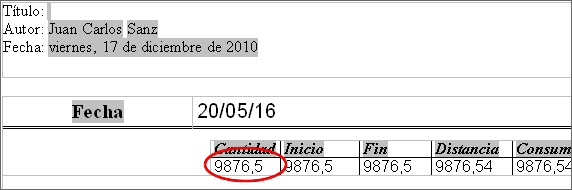
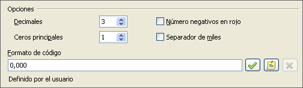
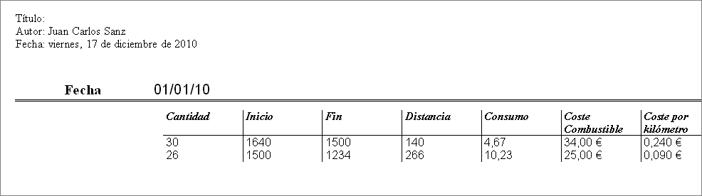

# Modificar un informe

Al final de la sección anterior, dejamos el informe Estadísticas combustible abierto en modo edición. Trabajaremos en este informe. Estos mismos pasos se pueden usar con cualquier informe que abra para editar.

El autor es el nombre que puso en **Herramientas →Opciones → LibreOffice → Datos de usuario**. La fecha no es correcta. Es necesario mover las columnas hacia la izquierda para que tengan un aspecto mejor. Ninguno de los números son correctos, pero su único propósito es mostrar el número de decimales.

### **Paso 1: cambiar la fecha.**

<li>
Pulse a la derecha de la fecha (17/12/10), de modo que el cursor esté a continuación del campo. Utilice la tecla *Retroceso* para borrar la fecha.
</li>
<li>
**Insertar → Campos → Fecha**. Esto pone la fecha de hoy donde estaba la fecha original.
</li>
<li>
Cambie el formato de la fecha:
</li>

**Insertar → Campos → Fecha**. Esto pone la fecha de hoy donde estaba la fecha original.

<li>
Haga doble clic en el campo de fecha que acaba de insertar. Se abre la ventana Editar campo:Documento (Figura 68).
</li>

<ol type="a" start="2">
<li>
Puesto que es un informe dinámico, cambie el campo Selección de Fecha (fija) a Fecha.
</li>
<li>
Cambie el Formato al que desee (yo he usado la opción viernes, 31 de diciembre de 1999). Haga clic en **Aceptar**.
</li>

Cambie el Formato al que desee (yo he usado la opción viernes, 31 de diciembre de 1999). Haga clic en **Aceptar**.

**Paso 2: cambie el ancho de las columnas.**

Se puede cambiar el ancho de las columnas moviendo el cursor sobre el borde derecho de cada columna para que se convierta en una flecha doble. Entonces arrástrelo y suéltelo donde quiera. Esto hay que hacerlo con cada columna en cada tabla del informe. También se puede hacer con la última columna de la derecha, aunque no tenga borde negro. Ahora debería parecerse al de la Figura 69.

**Paso 3: cambie el formato numérico de las celdas.**

La cantidad de combustible debería tener tres lugares decimales. El Principio, Fin y Distancia deberían tener un lugar decimal. El Coste combustible debería ser moneda y tener 2 decimales y Coste por kilómetro debería tener tres lugares decimales.

<li>
Haga clic con el botón secundario en la celda de debajo de Cantidad y seleccione **Formato numérico.** 
</li>
<li>
En la sección *Opciones.* 
</li>

En la sección *Opciones.* 

<li>
Cambie el número de decimales a 3.
</li>
<li>
Haga clic en la marca de verificación verde. Haga clic en **Aceptar**.
</li>

Haga clic en la marca de verificación verde. Haga clic en **Aceptar**.

<li>
Cambie el campo Coste combustible.
</li>

<li>
Haga clic con el botón secundario en la celda que hay debajo de *Coste combustible*.
</li>
<li>
Seleccione **Formato numérico**.
</li>
<li>
En la lista Categoría, seleccione *Moneda *y haga clic en **Aceptar**.
</li>

Seleccione **Formato numérico**.

<li>
Cambie el campo Coste por kilómetro.
</li>

<li>
Pulse con el botón derecho en la celda que hay debajo de *Coste por kilómetro*.
</li>
<li>
Seleccione **Formato numérico***.*
</li>
<li>
En la lista Categoría, seleccione *Moneda*.
</li>
<li>
En la sección Opciones:
</li>
<li value="1">
Ponga 3 en Decimales.
</li>
<li>
Pulse la marca de verificación verde.
</li>
<li>
Haga clic en **Aceptar**.
</li>

Seleccione **Formato numérico***.*

En la sección Opciones:

Pulse la marca de verificación verde.

**Paso 4: guarde y cierre el informe.**

Haga doble clic en el informe. Ahora debería parecerse a la siguiente imagen.

