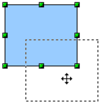
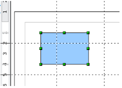

# Mover objetos dinámicamente

Para mover un objeto, selecciónelo, luego pulse el borde del objeto y, sin soltar el ratón, mueva el objeto. Para dejar el objeto en su nuevo sitio, suelte el botón del ratón.

Durante el movimiento, la forma del objeto aparecerá como una línea de puntos, para ayudarle a ver su nueva posición.

