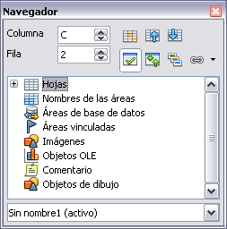
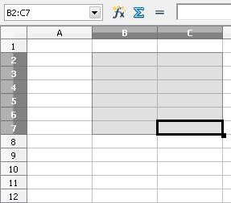

# Navegar por las hojas de cálculo

Calc tiene muchas formas de navegar por la hoja de cálculo entre las celdas y entre las hojas. Puede usar el método que prefiera.

## Ir a una celda en particular

**Usando el ratón**

Ponga el puntero del ratón sobre la celda y pulse en ella.

**Usando una referencia de celda**

Pulse sobre el pequeño triángulo invertido que hay justo a la derecha del cuadro de nombre. La referencia a la celda existente queda resaltada. Escriba la referencia a la celda que quiere ir y pulse *Enter*, o pulse dentro del cuadro de nombre, pulse la tecla retroceso al editar la referencia existente y escriba la referencia que desee.

**Usando el Navegador**

En el Navegador (F5) haga doble clic en la barra de estado, donde indica la secuencia de hoja. Escriba la referencia a la celda en los dos campos superiores, etiquetados como Columna y Fila, y pulse *Enter*. En la siguiente imagen, el Navegador tiene seleccionada la celda C2.

El Navegador muestra listas con todos los objetos de la hoja de cálculo, agrupados en categorías. Si aparece un indicador (un signo de más o una flecha) junto a una categoría, al menos existe un objeto de esta categoría. Para abrir una categoría y ver la lista de elementos, pulse en el indicador.

Para ocultar la lista de categorías y mostrar sólo los iconos de la parte superior, pulse el icono **Contenidos** . Vuelva a pulsar el icono para mostrar la lista.

## Movimiento de celda en celda

**Usando el ratón**

Para mover el foco usando el ratón, simplemente mueva el puntero del ratón a la celda donde debe estar el foco y pulse en ella. Esto cambia el foco a la nueva celda. Este método es el más útil cuando las dos celdas están muy separadas.

**Usando las teclas Tab y Enter**

<li>
Al pulsar *Enter* o *Mayúsculas **+ Enter*, el foco se mueve hacia abajo o hacia arriba, respectivamente.
</li>
<li>
Al pulsar *Tab* o *Mayúsculas **+ Tab*, el foco se mueve hacia la derecha o hacia la izquierda, respectivamente.
</li>

Al pulsar *Tab* o *Mayúsculas **+ Tab*, el foco se mueve hacia la derecha o hacia la izquierda, respectivamente.

**Usar las teclas de flechas**

Al pulsar las teclas de las flechas en el teclado, el foco se mueve en la dirección indicada por la flecha.

**Usar Inicio, Fin, AvPag y RePag**

<li>
La tecla *Inicio* mueve el foco al principio de la fila.
</li>
<li>
La tecla *Fin* mueve el foco a la columna más lejana de la derecha que tenga datos.
</li>
<li>
La tecla *AvPag* mueve la vista una pantalla hacia abajo, y *RePag* la mueve una pantalla hacia arriba.
</li>

La tecla *Fin* mueve el foco a la columna más lejana de la derecha que tenga datos.

 

