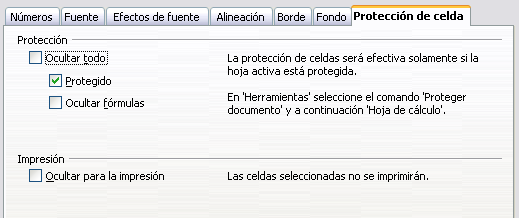

# Ocultar y mostrar datos

Cuando los elementos están ocultos, no se ven ni se imprimen, pero aún se pueden seleccionar para copiar si se seleccionan los elementos a su alrededor. Por ejemplo, si la columna B está oculta, esta se copia si se seleccionan las columnas A y C. Cuando necesite un elemento oculto de nuevo, puede revertir el proceso, y mostrar el elemento.

Para ocultar o mostrar hojas, filas y columnas, use las opciones del menú Formato o pulse con el botón derecho para abrir el menú contextual. Por ejemplo, para ocultar una fila, primero seleccione la fila, y luego elija **Formato ****→**** Fila ****→**** Ocultar** (o pulse el botón derecho y elija **Ocultar**).

Para ocultar o mostrar celdas, elija **Formato ****→**** Celdas** desde la barra de menús (o pulse con el botón derecho y elija **Formato de celdas**). En el diálogo formato de celdas, vaya a la pestaña protección de celda.

