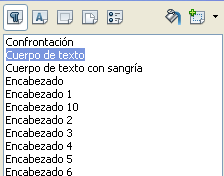
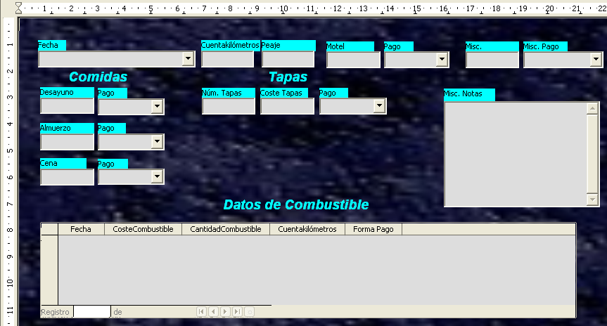

# Paso 10: cambiar el fondo del formulario

El fondo del formulario puede ser un color o un gráfico (imagen). Puede usar cualquier color de la Tabla de colores en **Herramientas → Opciones → LibreOffice → Colores**. Si sabe cómo crear colores personalizados, puede usarlos. También puede utilizar una imagen como fondo.

Si elige un fondo oscuro, puede necesitar cambiar muchas de las etiquetas y encabezados para que puedan verse.

<li value="1">
Seleccione las etiquetas de la fila superior de controles.
</li>

<li>
Mantenga pulsada la tecla *Control* y haga clic en la etiqueta Fecha.
</li>
<li>
Mientras mantiene pulsadas las teclas *Mayúsculas y **Control,* haga clic en el resto de las etiquetas de la fila superior. El borde va aumentando hacia la derecha hasta que incluye todas las etiquetas.
</li>

Mientras mantiene pulsadas las teclas *Mayúsculas y **Control,* haga clic en el resto de las etiquetas de la fila superior. El borde va aumentando hacia la derecha hasta que incluye todas las etiquetas.

<li>
Pulse el icono **Control** en la barra de herramientas Diseño de formulario para abrir el diálogo Propiedades.
</li>
<li>
Cambie la selección *Color de fondo* de *Predeterminado* a *Turquesa claro*. Cierre el diálogo Propiedades.
</li>

Cambie la selección *Color de fondo* de *Predeterminado* a *Turquesa claro*. Cierre el diálogo Propiedades.

<li>
Seleccione las otras etiquetas del mismo modo y cambie su color de fondo.
</li>
<li>
Para cambiar el color del tipo de letra (fuente) de los encabezados:
</li>

Para cambiar el color del tipo de letra (fuente) de los encabezados:

<li value="1">
Abra Estilo y formatos usando la tecla *F11*. Asegúrese de que está seleccionado el icono Párrafo en el extremo izquierdo de los iconos de la imagen.
</li>

<li>
Pulse con el botón derecho en el estilo Encabezado 2 para abrir el menú contextual y elija **Modificar **en este menú.
</li>
<li>
En la ventana *Estilo de párrafo: Encabezado 2* pulse la pestaña **Efectos de fuente**. Cambie *Color de la fuente* de *Automático* a *Turquesa claro*.
</li>
<li>
Pulse **Aceptar** para cerrar la ventana.
</li>

En la ventana *Estilo de párrafo: Encabezado 2* pulse la pestaña **Efectos de fuente**. Cambie *Color de la fuente* de *Automático* a *Turquesa claro*.
<td width="661" bgcolor="#83caff">**Sugerencia**</td><td width="3684" valign="top">A veces puede ser muy útil aprender a usar los estilos. Mediante el uso de estilos hemos cambiado el color del tipo de letra (fuente) de los tres encabezados al mismo tiempo. Hay otros métodos para cambiar el color, pero requieren repetir el mismo paso para cada uno de los encabezados.</td>

A veces puede ser muy útil aprender a usar los estilos. Mediante el uso de estilos hemos cambiado el color del tipo de letra (fuente) de los tres encabezados al mismo tiempo. Hay otros métodos para cambiar el color, pero requieren repetir el mismo paso para cada uno de los encabezados.

<li>
Para añadir un gráfico de fondo:
</li>

<li value="1">
Pulse en el fondo con el botón derecho del ratón y seleccione **Página** en el menú contextual.
</li>
<li>
En la ventana Estilo de página, pulse la pestaña Área o Fondo, cambie de *Color* a *Gráfico* o **Mapa de bits **en la lista desplegable *Relleno.*
</li>
<li>
Haga clic en Importar imagen para buscar y seleccionar el archivo gráfico que quiera usar y pulse **Aceptar**.
</li>
<li>
El formulario debería parecerse al de la siguiente imagen.
</li>

En la ventana Estilo de página, pulse la pestaña Área o Fondo, cambie de *Color* a *Gráfico* o **Mapa de bits **en la lista desplegable *Relleno.*

El formulario debería parecerse al de la siguiente imagen.

