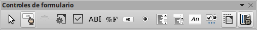

# Paso 1: cambiar el campo Fecha

<li value="1">
Haga clic sobre el campo Fecha mientras mantiene pulsada la tecla *Control *para seleccionarlo.
</li>
<li>
Mueva el cursor sobre el punto de control verde central del lado derecho. El cursor cambiará a la forma de una doble flecha.
</li>
<li>
Mantenga pulsado el ratón mientras arrastra el cursor hacia la derecha hasta que la longitud sea de 6 cm. La línea vertical de puntos queda alineada con el 6. Suelte el botón del ratón.
</li>
<li>
</li>

Mueva el cursor sobre el punto de control verde central del lado derecho. El cursor cambiará a la forma de una doble flecha.

<li>
Desplácese hasta *Formato de fecha*. Verá una lista desplegable con el valor predeterminado *Estándar (corto)*. Pulse para desplegar la lista y seleccione *Estándar (largo)*.
</li>
<li>
Desplácese hasta *Desplegable* y haga clic. Se abrirá otra lista desplegable cuyo valor predeterminado es *No*. Seleccione *Sí*.
</li>

Desplácese hasta *Desplegable* y haga clic. Se abrirá otra lista desplegable cuyo valor predeterminado es *No*. Seleccione *Sí*.
<td width="15%" bgcolor="#83caff">**Sugerencia**</td><td width="85%" valign="top">Para ver el aspecto del campo Fecha, pulse el icono **Modo diseño On/Off** (el segundo icono por la izquierda en la imagen). Puede hacer esto en cualquier momento para ver el formulario con los cambios que haya realizado.</td>

Para ver el aspecto del campo Fecha, pulse el icono **Modo diseño On/Off** (el segundo icono por la izquierda en la imagen). Puede hacer esto en cualquier momento para ver el formulario con los cambios que haya realizado.

